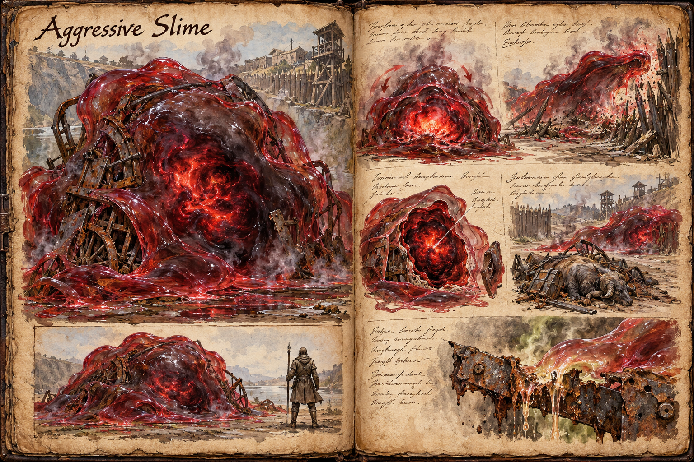

# Aggressive Slime

Nothing in the bestiary is hungrier than the Aggressive Slime, the final form of the [Slime](Slime.md) family: an opaque red mass around a darker core, at least 3 metres across and with no upper limit on its size. It attacks anything it senses without provocation and follows the scent of food across open country. A player who has raised one, or who has left a neutral slime to feed on the wrong things, has built a siege engine that answers to its stomach alone.

## Size and Growth

An aggressive slime starts at about 3 metres across and keeps growing for as long as it finds food. There is no size cap, but the food it needs rises steeply with every stage, so the largest specimens take more feed than any realistic supply delivers. A slime the width of a village or a fortress is out of reach in practice, because nobody can feed one that much. A mature specimen can still overwhelm a dragon, which is why the growth is worth watching even when it is slow.

The body is a procedurally generated mesh rather than a fixed sculpted model. Art and animation build it as a system, so it takes whatever size and shape its growth and surroundings produce, bulging, sagging, and throwing out new pseudopods as it feeds instead of being one creature model scaled up. Two aggressive slimes of the same age need not look alike.

## Appearance and Visual Design

The gel is opaque and dense, red at the edges and black around the core, a dark nucleus that shows through the body as a shadow and pulses from within. Corrosion fumes haze the air around it, and whatever it has eaten stays visible in the mass: rusted metal, rib cages, the fittings of wrecked wagons. It moves in heavy surges that shake the ground, throwing out large pseudopods the thickness of tree trunks to drag itself forward and to seize prey, and where the passive and neutral forms creep, this one flows across ground it has no intention of leaving.

## Encounter and Counterplay

Provocation means nothing to an aggressive slime; it goes where the food is. A slime lured by bait heads for the source, so a carcass trail or a cart of metal scrap can draw it toward a chosen place, and it attacks whatever structure or creature stands in its way. Because it obeys no one (see [Taming and Control](../Taming-and-control.md)), whoever baits it has to stay ahead of it.

Its core brightens and the body heaves inward just before a surge and an engulfing sweep. The corrosion that follows is the worst in the family and strips armour and equipment quickly. The usual counters from [Slime](Slime.md) apply, but the dark core is the one weak point in the mass, and a player who gets close enough can strike it through the gel. Killing a slime before it has grown is far easier than killing it after.

A dead aggressive slime leaves gel, acid sacs, and the dissolved metals its diet put into it, which make it worth hunting for crafters who can use them.

## Story Hook

A rival guild has been baiting a slime along the river road for a week, leaving dead livestock every few hundred metres, and the trail now points at the palisade of a small mining outpost. The miners cannot outrun it, cannot shoot it, and cannot afford to burn the road, so the foreman posts a reward for anyone who can reach the dark core, or find whoever is laying the bait and make them stop.

See also: [Creatures index](../Creatures.md), [Slime](Slime.md), [Passive Slime](Passive-slime.md), and [Neutral Slime](Neutral-slime.md).

## Concept Drawing

## Draft

<!-- Raw notes land here. Add new content in any form; an AI assistant reworks it into the body above as finished prose, then clears what it has integrated. -->
