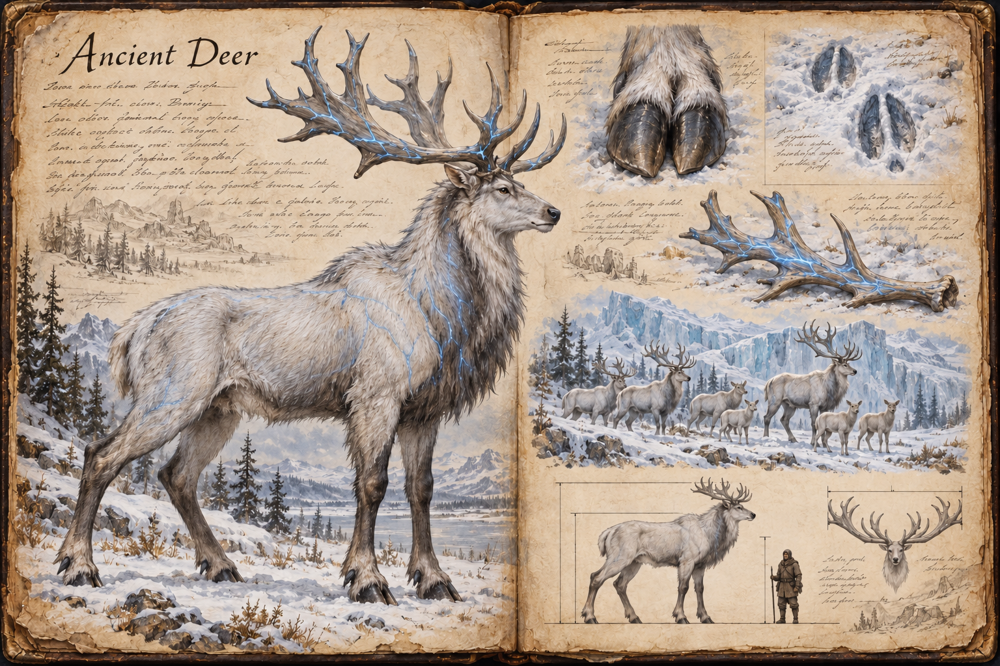
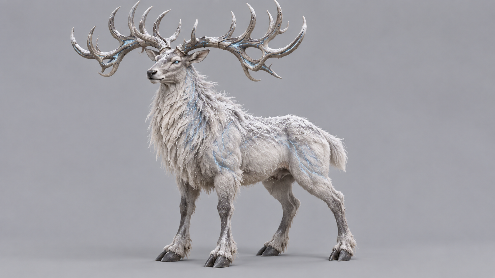

# Ancient Deer

Ancient Deer are majestic, magical creatures that haunt the remote tundras of the wild. A grown animal stands 3 metres at the shoulder, measures about 4,5 metres from nose to tail, and weighs around 2 tonnes, and it blends so completely into its snowbound country that its presence is more often felt than seen. To come upon a herd is to encounter a living legend rather than a quarry.

## Appearance and Visual Design

An Ancient Deer looks like a tundra legend that has learned to survive weather rather than escape it. It is a four-legged, cloven-hoofed deer with a deep chest, long legs, and a high narrow head carried in absolute stillness while snow moves around it. Its coat is thick against the bitter cold, white and silver at a distance, but close inspection reveals pale grey guard hairs, frost caught in the mane, and darker underfur around the joints where the body needs warmth most. The hooves are broad and split, spreading on snow so the animal stays on the surface of a drift that would swallow a horse.

Magic is present but restrained. Faint blue mana-veins pulse beneath the fur like rivers seen through ice, brightest along the neck, chest, and flanks after the creature has used its power. Both sexes carry antlers once grown, bone-grey and spreading like wind-shaped branches to a span of about 3 metres, and the fine cracks in them release a subtle blue glow that turns falling snow into drifting sparks around the crown. Calves grow none. The eyes glow only faintly, but they are steady and intelligent, giving the creature the unsettling calm of something that has watched whole hunting parties pass and chosen not to be seen. A herd is readable by silhouettes emerging and vanishing in snow haze, with the oldest deer almost indistinguishable from frost-rimed trees until the antlers move.

## Movement

An Ancient Deer walks with a slow, stalking gait, placing each hoof with care and leaving a line of broad, deep prints in the snow that a tracker can follow. It has no need to hurry while undisturbed. When it flees it bounds in long, climbing leaps across the drifts, fast enough that no hunter on foot keeps pace.

## Herd and Behaviour

Ancient Deer thrive in the harshest climates, preferring the isolated, snow-covered reaches of the [Tundra](../Biomes/Tundra.md), far from human interference. They live in tight-knit herds of four to eight, with the oldest animals leading and the calves kept in the middle. They move through their environment with a grace that belies their size, their bond with the land so deep that they can summon snowstorms to shroud their presence, using the elements not to devastate but to survive. Generally peaceful and cautious, they avoid contact and leave rather than fight.

## Storm and Ice

When a threat comes near or an attack lands, the oldest deer raise a storm, and the herd uses it to get away. The tell is on the animals themselves: the blue veins brighten along the neck and flanks, the antler cracks flare, and the wind picks up, whipping snow into flurries that blind and disorient pursuers. Barriers of ice then rise across the predator's path and around the calves while the herd bounds off. The display is as much warning as defence, and a wise traveller takes the hint. A cornered animal will lower its antlers and fight, but it would rather be gone.

The storm is a wall that can be worked around. Fire melts the ice barriers, shelter from the wind keeps the flurries from wearing a party down, and a hunter who presses in during the storm finds the herd busy fleeing rather than defending. A herd that loses one of its members does not stay to avenge it: it moves away, and the area stays empty of deer for a long time afterwards.

## Rarity and Allure

The allure of the Ancient Deer lies not only in its striking form but in the magic worked into its body. Its mana-infused antlers are prized as components for enchanted weapons and artefacts, and its shimmering fur is sought for protective cloaks and garments, which has made it a target for hunters and adventurers alike. Antlers and fur are the only things a kill yields. Elusiveness and the sheer difficulty of bringing one down keep the deer rare, so that it remains a fleeting glimpse of a world untamed rather than a reliable harvest.

There is a bloodless alternative. The deer shed their antlers every year, and a shed antler found lying in the snow is of the same quality as one taken from a kill. Shed antlers are rare and hard to find, which makes them the harder prize, but they cost no animal its life and provoke no storm.

## Story Hook

A renowned artificer puts out word that a commission, an heirloom weapon for a frontier lord, requires the mana-rich antler of an Ancient Deer, and the bounty is enough to fund a season's expedition into the deep tundra. The hunt that follows is the easy part to describe and the hard part to live: the herd cannot be approached without rousing its storms, and a player who tracks it long enough is forced to decide whether a living legend is worth killing for a price, or whether a shed antler, harder to come by but bloodless, is the prize they would rather carry home.

See also: [Creatures index](../Creatures.md) and the [Tundra](../Biomes/Tundra.md) it haunts.

## Concept Drawing

## Inspiration

The Ancient Deer is drawn from [Morozova's stag](https://shadowandbone.fandom.com/wiki/Morozova%27s_Stag) of the Shadow and Bone series, an immense, near-mythical stag whose antlers carry power and draw hunters across the land. The game keeps the giant size and the hunt for its antlers. It differs in being a living herd rather than a single beast, in defending itself with storm and ice, and in offering a bloodless route to the prize through shed antlers.

## Draft

<!-- Raw notes land here. Add new content in any form; an AI assistant reworks it into the body above as finished prose, then clears what it has integrated. -->
