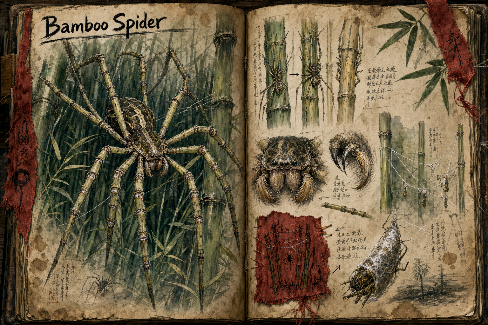

# Bamboo Spider

The Bamboo Spider is a large and deadly ambush predator of the dense bamboo forests, perfectly adapted to the one biome it haunts. Its long, slender legs mimic the bamboo stalks around it so closely that the creature all but disappears into the grove, making it a silent and efficient hunter that can strike before its prey ever registers the danger. It is the reason the [Bamboo Jungle](../Biomes/Bamboo-jungle.md) is a place to move through carefully rather than quickly.

## Appearance and Visual Design

A Bamboo Spider is unnerving because it almost succeeds at not looking like a creature. Its legs are long, straight, and segmented like bamboo culms, with raised ring joints that mimic nodes and a muted green-yellow surface broken by darker scars. When it waits, it spreads those legs among real stalks and lifts its body high enough that the abdomen reads as a shadow caught in the canopy. Fine bristles along the limbs resemble leaf fibres and catch falling debris, further breaking the outline.

The body is compact compared with the leg span, with a dark, lacquered carapace mottled in greens, browns, and pale straw colours. Its eyes are small and set low under a forward ridge, flashing only when the player is already too close, and its mouthparts are more precise than monstrous, built for a sudden killing strike rather than messy feeding. Webbing is used sparingly as a visual clue: thin strands stretched between stalks, bundles of wrapped prey tucked above head height, and silk scars on bamboo where the spider has used the grove as a trap framework.

## Ambush and Camouflage

Patient and calculating, the Bamboo Spider lies motionless for long stretches, waiting for unsuspecting prey to wander within reach before striking with astonishing speed and precision, using its powerful limbs to immobilise a victim and deliver a killing blow. Its camouflage is good enough that even experienced adventurers struggle to pick it out among the stalks, which turns a fight against one into a contest of awareness rather than raw power. The forest itself gives the warning to those who can read it: a subtle movement where nothing should move, or an eerie stillness where the grove should be alive, is often the only notice a player gets.

## Reading the Signs

For the careful, the Bamboo Spider becomes a puzzle of observation rather than an unavoidable death. Learning its telltale signs, the wrongness in a patch of bamboo, the silence that falls where birds should be calling, turns the predator's great strength, its invisibility, into a weakness, since a spider that has been spotted before it strikes has lost the only advantage it relies on. This is the lesson the bamboo forests teach: vigilance is worth more here than armour.

## Story Hook

A bamboo-cutter's camp keeps losing workers to the deep groves, always the ones who went in alone and always without a sound. The survivors have started marking suspect stalks with strips of red cloth, and a player who follows the trail of markers into the heart of the grove finds both the spider that has been feeding there and the grim, practical map the cutters made of a hunter they could never quite see.

See also: [Creatures index](../Creatures.md) and the [Bamboo Jungle](../Biomes/Bamboo-jungle.md) it hunts.

## Concept Drawing

## Draft

<!-- Raw notes land here. Add new content in any form; an AI assistant reworks it into the body above as finished prose, then clears what it has integrated. -->

it has 4 meter long legs which makes their body positioned up in the tops of the bamboo leaves making them extreemly well hidden