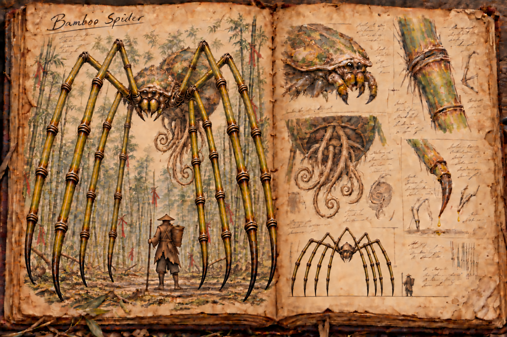
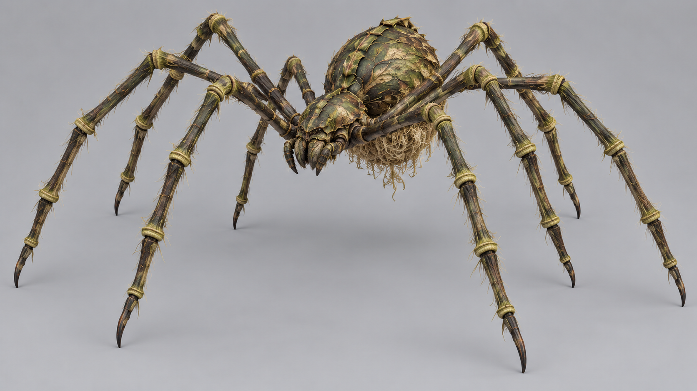

# Bamboo Spider

The Bamboo Spider is a lone ambush predator of the dense bamboo groves, and the reason the [Bamboo Jungle](../Biomes/Bamboo-jungle.md) is a place to move through carefully rather than quickly. It stands about 6 metres tall on eight jointed legs, each around 7 metres long, planted on the ground among the real stalks so that its compact body hangs in the grove's leafy layer, far above the eye line of anyone below. Its legs are built to be mistaken for bamboo, and from underneath a waiting spider is simply a few more culms in a forest of them.

## Appearance and Visual Design

A Bamboo Spider is unnerving because it almost succeeds at not looking like a creature. Its eight legs are long, straight, and segmented like bamboo culms, with raised ring joints that mimic nodes and a muted green-yellow surface broken by darker scars. All eight attach to the forepart of the body and leave it at a steep upward angle before bending down to the ground, so the body rides at the top of a tall cage of stalks rather than between the legs. When the spider waits, it spreads those legs among real bamboo and holds its body high enough that the abdomen reads as a shadow caught in the canopy. Fine bristles along the limbs resemble leaf fibres and catch falling debris, further breaking the outline.

The body is two parts and small compared with the legs: a forepart about 1,5 metres long and a rounded abdomen a little longer, weighing roughly 600 kilograms in all. The carapace is dark and lacquered, mottled in greens, browns, and pale straw colours. The eyes are small and set low under a forward ridge, flashing only when a player is already too close, and the mouthparts are more precise than monstrous, built for a sudden killing strike rather than messy feeding. From the underside of the abdomen hangs a fringe of pale, fibrous tendrils, each as thick as an arm and several metres long, normally coiled tight and hard to see from below. Bundles of wrapped prey tucked above head height are the clearest sign that a grove has an owner.

## Movement

The spider keeps its legs among the stalks the way a heron keeps its legs in reeds, placing each tip with care and moving almost without disturbing a leaf. For a repositioning it walks in a slow, high-stepping stalk, and when prey bolts or it must retreat it runs, using the legs' hooked tips to go straight up the culms and down again at a speed no player on foot matches. It never crosses open ground willingly, and a grove cleared of bamboo is a grove it abandons.

## Ambush and Attack

Patient and calculating, the Bamboo Spider lies motionless for long stretches, waiting for prey to wander within reach. The strike is a stab: a leg tip drives down through the target and injects a paralytic venom, and a victim who has been hit is unable to move for long enough for the spider to finish the job. The tendrils then uncoil from the underbelly, wrap the paralysed prey, and draw it up into the canopy, where it is out of reach of any rescue from the ground. The whole sequence is fast, and a player who has been stabbed and lifted can only hope an ally reaches the spider before the body disappears into the leaves.

Its camouflage is good enough that even experienced adventurers struggle to pick it out among the stalks, which turns a fight against one into a contest of awareness rather than raw power. The warning is in the grove itself: stalks that do not sway when their neighbours do, a low creak of bamboo taking weight, and a sudden silence where the grove should be alive. Reading those signs turns the predator's great strength, its invisibility, into a weakness, since a spider that has been spotted before it strikes has lost the only advantage it relies on. Vigilance is worth more here than armour.

## Counterplay and Rewards

Once it is seen, the spider gives up the ambush and withdraws deeper into the grove unless prey is already within reach of a leg. A player who stands and fights attacks the joints of the long legs, which are the softest and most exposed part of the animal and can be severed to bring its body lower, and puts ranged weapons into the body high above. Fire works well on dry bamboo and forces the spider to move, but it burns the grove's resources and the player's own cover along with it.

A dead Bamboo Spider yields its venom glands for alchemy and poisons, light and unusually strong leg segments that make good bows and spear shafts for the [Crafting](../Crafting.md) trades, and coils of tendril fibre. It hunts alone, which separates it cleanly from the [Swamp Spider](Swamp-spider.md): the swamp's spiders are a swarm that overwhelms by numbers, while the Bamboo Spider is a single ambusher that wins or loses in one moment of inattention.

## Story Hook

A bamboo-cutter's camp keeps losing workers to the deep groves, always the ones who went in alone and always without a sound. The survivors have started marking suspect stalks with strips of red cloth, and a player who follows the trail of markers into the heart of the grove finds both the spider that has been feeding there and the grim, practical map the cutters made of a hunter they could never quite see.

See also: [Creatures index](../Creatures.md) and the [Bamboo Jungle](../Biomes/Bamboo-jungle.md) it hunts.

## Concept Drawing

## Inspiration

The Bamboo Spider descends from [Mother Longlegs](https://godzilla.fandom.com/wiki/Mother_Longlegs) of the Monsterverse, the giant spider of Kong: Skull Island. It borrows the bamboo-stalk legs, the body held high in the foliage, the ambush, the paralytic venom delivered through the legs, and the tendrils under the belly that ensnare prey. Here the spider has no extra pincer arms: it kills with its eight legs and its tendrils alone, at a height of about 6 metres.

## Draft

<!-- Raw notes land here. Add new content in any form; an AI assistant reworks it into the body above as finished prose, then clears what it has integrated. -->
