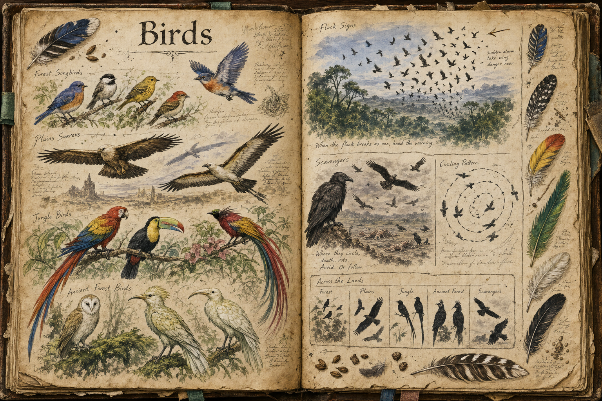

# Birds

Birds are the world's quietest source of information. They rarely matter as enemies, but they matter constantly as signal: the way a flock behaves is a readable cue to what is happening in a stretch of country, and a player who learns to watch the sky gains an edge that has nothing to do with combat. Their role looks simple and is in fact one of the small systems that makes the world feel alive and interconnected.

## Appearance and Visual Design

Birds are treated as a family of readable silhouettes rather than as one uniform creature. Small forest birds appear as quick flashes of colour between trunks, with bright throats and short darting flights that make a healthy woodland feel busy. Plains birds have longer wings, cleaner profiles, and ground-running behaviours that make them visible against grass and horizon. Jungle birds are louder in colour and motion, using saturated feathers, long tails, and sudden vertical climbs to make the canopy feel dense and layered. Ancient forest birds are stranger and more restrained, with pale plumage, moss-tinted markings, or slow gliding patterns that make them feel at home in an older, quieter wood.

Their visual design is mostly about behaviour at scale. A relaxed flock scatters unevenly, perches at different heights, and returns to feeding quickly. A frightened flock breaks upward in a single wave, turning the sky into a warning flare. Scavengers use darker silhouettes, circling motion, and gathering density to mark death from far away, while small songbirds leave gaps in their usual movement when a predator or hidden party is near. The player does not need a UI marker to read them; the shape, colour, and rhythm of the birds are the marker.

## Reading the Signs

When danger stirs, birds react before a player can, breaking from cover and climbing away in flocks. A sudden flight of birds over a treeline is a warning of something moving beneath it, an approaching predator, a rival party, or a disturbance worth investigating, and the observant traveller treats it as the free reconnaissance it is, avoiding an ambush or bracing for a fight a less attentive player would walk into blind. Certain species carry their own meaning: crows and other scavengers gather over corpses and old battlefields, so a wheeling flock of them marks a recent killing, an abandoned site, or ground a predator may still be working. The world speaks through these small reactions, and learning its vocabulary is part of becoming a capable wilderness traveller.

## Habitat

Birds are common across the temperate and warm biomes, filling the skies of the [Forest](../Biomes/Forest.md), the open [Plains](../Biomes/Plains.md), the dense [Jungle](../Biomes/Jungle.md), and the old canopy of the [Ancient Forest](../Biomes/Ancient-forest.md), where their constant presence and reactions give each of those places its living backdrop.

## Story Hook

A frontier scout teaches new arrivals a single lesson before anything else: watch the birds, not the road. The players who take it to heart find that a flock breaking from a distant ridge has saved more lives than any blade, and the ones who ignore it learn the same lesson the harder way, on a quiet path that the birds had already abandoned.

See also: [Creatures index](../Creatures.md) and the [Forest](../Biomes/Forest.md), [Plains](../Biomes/Plains.md), [Jungle](../Biomes/Jungle.md), and [Ancient Forest](../Biomes/Ancient-forest.md) it fills.

## Concept Drawing

## Draft

<!-- Raw notes land here. Add new content in any form; an AI assistant reworks it into the body above as finished prose, then clears what it has integrated. -->
