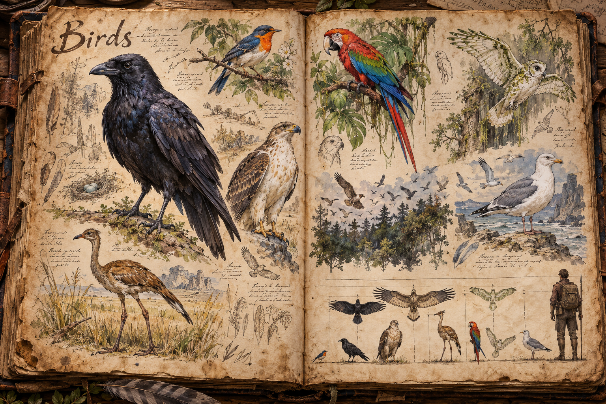

# Birds

Birds are the world's quietest source of information. They rarely matter as enemies, but they matter constantly as signal: the way a flock behaves is a readable cue to what is happening in a stretch of country, and a player who learns to watch the sky gains an edge that has nothing to do with combat. They are the long-range layer of the world's warning system, telling a traveller roughly where danger lies while it is still far off, and one of the small systems that makes the world feel alive and interconnected.

## Appearance and Visual Design

Birds are a family of readable silhouettes rather than one uniform creature, and each biome has its own few archetypes. Forest songbirds have a wingspan of 0,2 to 0,3 metres and show as quick flashes of colour between trunks, with bright throats and short darting flights that make a healthy woodland feel busy. Crows, with a span of about 1 metre, are black and heavy-winged scavengers that turn up wherever there is something dead. The plains hold two kinds of birds: soaring raptors, broad-winged and pale-bellied with a span of about 1,5 metres, that ride the thermals over the grass, and long-legged runners about waist-high that cross the open ground in fast, upright sprints and take to the air only when forced.

Jungle birds are louder in colour and motion. Parrots with a span of about 1 metre carry saturated plumage and long tails, and they climb the canopy in sudden vertical bursts that make it feel dense and layered. Ancient forest birds are stranger and more restrained: pale gliders with moss-tinted markings and slow, silent flight, about 0,6 metres across, at home in an older, quieter wood. On the [Coast](../Biomes/Coast.md), seabirds such as gulls, about 1 metre across, wheel over the shoreline and the wreck fields, following fishing boats and nesting on the sea stacks.

Their visual design is mostly about behaviour at scale. A relaxed flock scatters unevenly, perches at different heights, and returns to feeding quickly. A frightened flock breaks upward in a single wave, turning the sky into a warning flare. Scavengers use their dark silhouettes, circling motion, and gathering density to mark death from far away. The player does not need a UI marker to read them; the shape, colour, and rhythm of the birds are the marker.

## Reading the Signs

A flock lifts when something large comes near: a big predator, a rival party, or a group of players on the move. The birds react before the player can and from a long way off, so a sudden flight over a distant ridge or treeline tells the traveller roughly where a disturbance is and which way to avoid, and the observant player treats that as free reconnaissance, steering round an ambush or bracing for a fight a less attentive player would walk into blind. The signal is coarse by design. It says that something is over there, not what it is, and in the jungle the [Four-Armed Monkeys](Four-armed-monkey.md) take the warning from there.

The signal runs both ways. Players flush birds as readily as predators do, so a party that crashes through a thicket sends a flock into the sky and announces itself to anyone watching, and stealth means moving so that the birds stay settled. Weather gives false alarms as well: thunder, a sudden squall, or a hard gust will lift a flock with no predator anywhere near, and a careful traveller checks the sky before trusting the birds. Certain species carry their own meaning. Crows and other scavengers gather over corpses and old battlefields, so a wheeling flock marks a recent killing, an abandoned site, or ground a predator has claimed.

## Habitat

Birds are common across the temperate and warm biomes, filling the skies of the [Forest](../Biomes/Forest.md), the open [Plains](../Biomes/Plains.md), the dense [Jungle](../Biomes/Jungle.md), the old canopy of the [Ancient Forest](../Biomes/Ancient-forest.md), and the seabird colonies of the [Coast](../Biomes/Coast.md), where their constant presence and reactions give each place its living backdrop.

## Hunting and Drops

Birds are small game. Hunters can take them with a bow or a thrown weapon for a little meat, and every bird yields feathers that fletch arrows for [Crafting](../Crafting.md). Nests hold eggs, which players can gather from the trees, reeds, and sea stacks, though a player who raids a nest near a flock sets the whole flock off.

## Story Hook

A frontier scout teaches new arrivals a single lesson before anything else: watch the birds, not the road. The players who take it to heart find that a flock breaking from a distant ridge has saved more lives than any blade, and the ones who ignore it learn the same lesson the harder way, on a quiet path that the birds had already abandoned.

See also: [Creatures index](../Creatures.md), [Four-Armed Monkey](Four-armed-monkey.md) for the other half of the warning system, and the [Forest](../Biomes/Forest.md), [Plains](../Biomes/Plains.md), [Jungle](../Biomes/Jungle.md), [Ancient Forest](../Biomes/Ancient-forest.md), and [Coast](../Biomes/Coast.md) it fills.

## Concept Drawing

## Draft

<!-- Raw notes land here. Add new content in any form; an AI assistant reworks it into the body above as finished prose, then clears what it has integrated. -->
