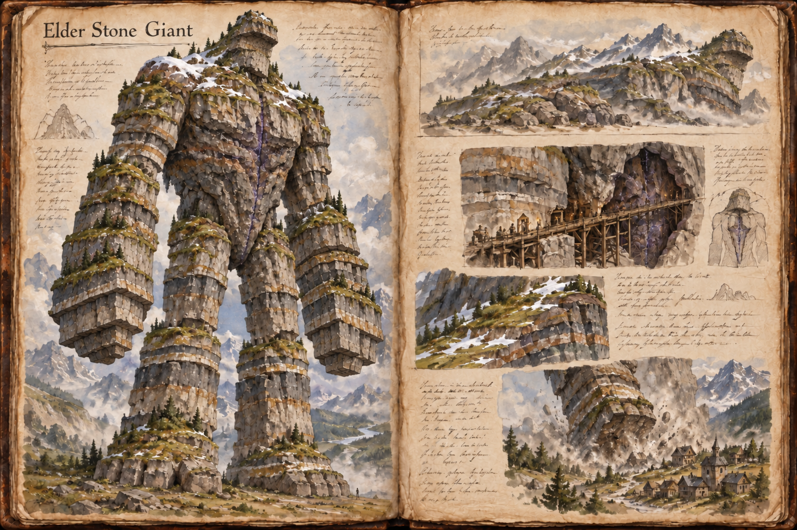

# Elder Stone Giant

Players who meet an elder remember the moment a ridge stood up. The Elder Stone Giant, the oldest form of the [Stone Giant](Stone-giant.md), is a colossus between 60 and 100 metres tall that weighs tens of thousands of tonnes, not a creature in the ordinary sense but a moving piece of the mountain.

## Appearance and Visual Design

The humanoid outline of the younger tiers is half lost in an elder. It still has two arms and two legs, but the arms hang like buttresses, stepped and terraced, and the legs are pillars that widen into broad, shelf-like feet. The back is a terraced slope, the brow a crag, and the face is a worn hollow where a person's would be. Strata of granite, basalt, shale and quartz run across the body in bands the width of a road, and the long weathering has laid moss, alpine grass, lichen and wind-bent shrubs across the shoulders and back, with snow collecting on the highest ledges. Only the crystals give it away: deep seams of violet and blue-white light glow through the rock along the spine and across the chest, dimly, like coals in a banked fire. The heart lies deep under the strata, far below the surface of the chest.

It is very slow. It stands for long stretches with its legs sunk into the rock, looking like a peak, and when it moves, it moves like a landslide, taking hours to cross a valley. A player can walk away from one at any time, and the danger is what it does to the ground on its way past.

## Encounter

An elder does not notice individuals. Its hostility is aimed at the place: a stomp flattens a hillside, a sweep of an arm clears a ridge of people and shelters together, and the shockwave it strikes into the ground rolls down a pass and brings the slopes down behind it. The warning signs described in the hub run on the same scale, with the grinding carried across a whole valley and the crystals flaring along the giant's full length. It attacks a settlement that stands in its path or a mine that strips crystal from its range, and it fights other elders in the same way, in battles that reshape the local terrain.

Killing one is a siege in the full sense. The heart is buried under the strata, so the pickaxe route in [Stone Giant](Stone-giant.md) means cutting a shaft into the giant's flank while it stands still, a job for a large group that can hold the ground around it. Starvation is the route most groups take: elders need more crystal than a region can give, and emptying their range of it is a long operation that a guild or a settlement can commit to, and that keeps the crystals in their hands. Siege weapons lose against sheer size but still work, in numbers.

Feeding an elder is not sustainable. Its hunger is greater than anything a settlement can mine, and a feeding buys only a short lull, long enough to move out of its way but not long enough to settle beside it.

## Story Hook

A high pass has been closed for a season because an elder stone giant has lain down across it, and the nearest dwarven holds are running short of the goods that used to cross it. The dwarves would prefer the giant to leave without being killed, but the elder has begun to stir toward a crystal-rich slope above their forge, and a guild of miners has offered to lead it away with a trail of crystals if someone else will protect the trail.

See also: [Creatures index](../Creatures.md), the [Stone Giant](Stone-giant.md) hub, the [Young Stone Giant](Young-stone-giant.md), the [Adult Stone Giant](Adult-stone-giant.md) it grew from, the [Building System](../Building-system.md) for the works a siege needs, and the [Mountain Range](../Biomes/Mountain-range.md).

## Concept Drawing

## Draft

<!-- Raw notes land here. Add new content in any form; an AI assistant reworks it into the body above as finished prose, then clears what it has integrated. -->
