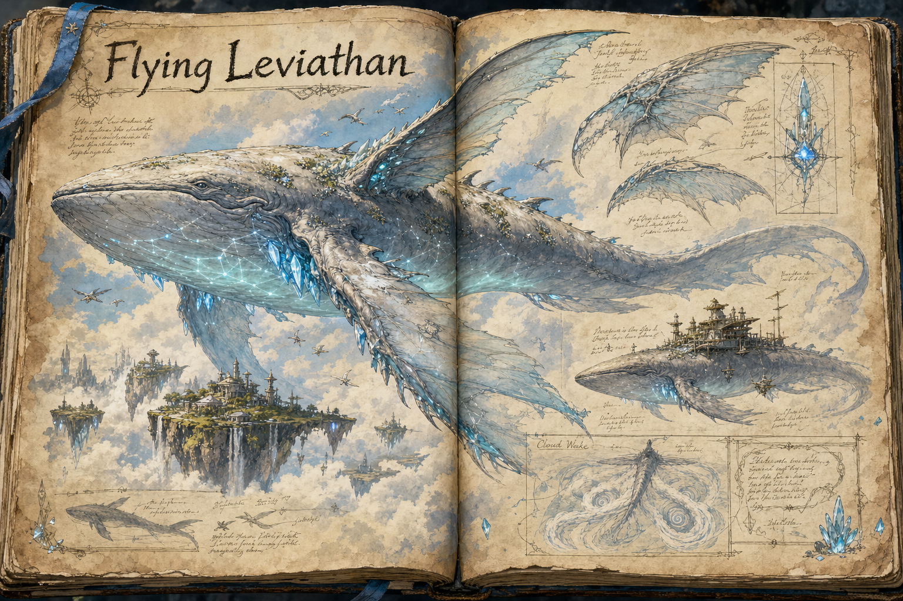

# Flying Leviathan

The Flying Leviathan is a majestic, whale-like creature that soars through the skies of the [Floating Islands](../Biomes/Floating-islands.md), a living testament to the magical energies of the world. These enormous beings can stay aloft indefinitely, never needing to land, a feat owed to the mana crystals of the floating islands: their bodies have adapted over generations to resonate with that specific mana frequency, and on it they simply defy gravity. To see one drift across the high sky is to understand at a glance how strange and how charged the upper world is.

## Appearance and Visual Design

A flying leviathan feels serene, impossible, and large enough to change the sky around it. Its body is whale-like in mass but adapted for air, with a broad head, long tapering body, and immense fin-wings that move slowly through cloud as if swimming through deep water. The skin is pale blue, pearl-grey, or cloud-white along the back, fading to a luminous underside where soft mana patterns glow like constellations seen through mist. Young leviathans are cleaner and brighter, while old ones carry wind-scarred skin, lichen-like crystal growths, and long trailing fins torn by centuries of weather.

The creature's scale is read through small details as much as through size. Birds draft along its flanks, clouds break over its brow, and loose structures on a tamed specimen sit against the curve of its back like huts on a ridge. Mana crystals embedded near the throat, spine, and fins pulse in rhythm with its low songs, creating visible waves through nearby vapour. When it banks, the whole light of an island can shift under its shadow, making the leviathan less a mount-shaped reward than a moving piece of the floating biome itself.

## Behaviour

Flying Leviathans are slow and deliberate fliers, peaceful by nature and awe-inspiring rather than threatening. Their sheer scale makes them more landscape than animal: small structures can be raised on their backs, turning a leviathan into a mobile base or a transport hub for anyone resourceful enough to tame one or to live alongside it. For a player who has reached the floating islands, a leviathan is among the most coveted prizes in the world, both as the grandest of the flying mounts described in [Travel and Mounts](../Travel-and-mounts.md) and as a foundation for the kind of aerial foothold the [Building System](../Building-system.md) makes possible.

## Bound to the Islands

A leviathan's freedom of the sky comes with a hard tether. During gestation and early maturity, a young leviathan must remain within the floating islands, where the concentrated mana sustains its development; an immature one that ventures beyond the biome lacks the magical attunement to keep itself aloft, and it dies. This binds the species to the islands as surely as the islands are bound to their crystals, and it shapes how players interact with them, since the leviathans cannot simply be led away and must be met, tamed, and worked with on their own high ground.

## Story Hook

When the first skywrights tried to tether a young leviathan, the creature answered with a song of low, rumbling tones, and they abandoned the attempt, learning instead to read the leviathans' migrations as heralds of shifting mana flows. A small shrine on a remote island still honours that bond between sky and maker, and a player who finds it discovers that the old skywrights left more than a monument behind: they left the beginnings of a method for working with the leviathans rather than against them.

See also: [Creatures index](../Creatures.md), the [Floating Islands](../Biomes/Floating-islands.md) it is bound to, and [Travel and Mounts](../Travel-and-mounts.md) for its place among flying mounts.

## Concept Drawing

## Draft

<!-- Raw notes land here. Add new content in any form; an AI assistant reworks it into the body above as finished prose, then clears what it has integrated. -->
