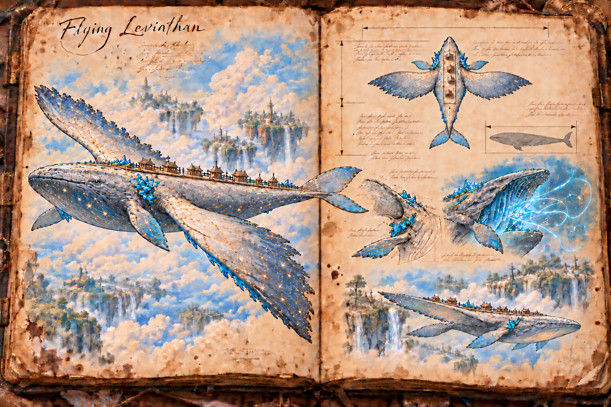

# Flying Leviathan

The Flying Leviathan is a whale-like giant of the high sky, a living testament to the magical energies of the world. It measures about 80 metres from brow to tail fluke and spans about 110 metres across its outstretched wing-fins, and its broad back carries a flat deck of roughly 50 by 15 metres, large enough to hold a small settlement. It never needs to land: a grown leviathan defies gravity on the mana of its own body and roams the whole world, and only its young stay bound to the [Floating Islands](../Biomes/Floating-islands.md) that raise them. To see one drift across the high sky is to understand at a glance how strange and how charged the upper world is.

## Appearance and Visual Design

A flying leviathan feels serene, impossible, and large enough to change the sky around it. Its body is that of a whale adapted for air: a broad, blunt head with a wide mouth line, a deep chest, and a long body that tapers into a muscular tail ending in a horizontal fluke. It has no legs. One pair of immense wing-fins grows from the shoulders, each as long as a ship and broad as a sail, and a pair of small pectoral fins further forward on the flanks acts as steering surfaces, tilting to turn the body much as a rudder turns a hull. The skin is pale blue, pearl-grey, or cloud-white along the back and the upper surfaces of the wing-fins, fading to a luminous underside where soft mana patterns glow like constellations seen through mist. Young leviathans are cleaner and brighter, while old ones carry wind-scarred skin, lichen-like crystal growths, and long trailing fin edges torn by centuries of weather.

The creature's scale is read through small details as much as through size. Birds draft along its flanks, clouds break over its brow, and loose structures on a tamed specimen sit against the curve of its back like huts on a ridge. Mana crystals embedded near the throat, spine, and fins pulse in rhythm with its low songs, creating visible waves through nearby vapour. When it banks, the whole light of an island can shift under its shadow, making the leviathan less a mount-shaped reward than a moving piece of the floating biome itself.

## Movement and Behaviour

A leviathan flies level, belly down, propelled by slow, deliberate strokes of its wing-fins and a rolling pump of the tail fluke, as if swimming through deep water. Left alone it drifts at about the pace of a walking horse, unhurried and almost soundless apart from its song. That pace does not make it slow to notice: it is peaceful by nature, awe-inspiring rather than threatening, and ignores players entirely, whether they watch from a distant ledge or land on its back. Its migrations follow the shifting mana flows of the world, which is why the skywrights came to read its routes as heralds of change.

When a leviathan is hurt it rises and flees. Its song climbs in pitch, the crystals along its spine flare, and a deep double stroke of the wing-fins announces a surge that carries it away at the speed of the fastest flying mounts in [Travel and Mounts](../Travel-and-mounts.md). The surge lasts only a short while before the creature falls back to its drift, so a pursuer that keeps pace outlasts it, but a ridden leviathan driven hard can be made to surge in the same way. Killing one takes a huge, sustained effort from many players, and the act carries a lasting cost to their standing in the [Reputation System](../Reputation-system.md).

## Young and Adult

A leviathan's freedom of the sky is earned over time. During gestation and early maturity a young leviathan must remain within the floating islands, where the concentrated mana sustains its development; an immature one that ventures beyond the biome lacks the magical attunement to keep itself aloft, and it dies. This ties the calves to the islands as surely as the islands are bound to their crystals, and it is why an encounter with a young leviathan is a meeting on its own high ground. An adult has grown its own crystals and carries the attunement within its body. It no longer needs the islands' mana to stay aloft and roams the whole world, following its migrations across plains, forests, and oceans alike.

## Taming and Riding

A leviathan cannot be led away young, so the path to owning one runs through [Parental Bonding](../Taming-and-control.md): a player raises a calf on the islands until it is grown, and only then is the adult free to leave the biome with its keeper. Once it has matured, a tamed leviathan is a true long-range mount and mobile base. One pilot steers it while others raise structures on the deck, following the rider-guides-the-creature approach of [Creature Riding](../Taming-and-control.md), and the [Building System](../Building-system.md) governs what the back can carry. For a player who has reached the floating islands, it is among the most coveted prizes in the world, the grandest of the flying mounts and the foundation of an aerial foothold no ground-bound raider can easily reach.

## Story Hook

When the first skywrights tried to tether a young leviathan, the creature answered with a song of low, rumbling tones, and they abandoned the attempt, learning instead to read the leviathans' migrations as heralds of shifting mana flows. A small shrine on a remote island still honours that bond between sky and maker, and a player who finds it discovers that the old skywrights left more than a monument behind: they left the beginnings of a method for working with the leviathans rather than against them.

See also: [Creatures index](../Creatures.md), the [Floating Islands](../Biomes/Floating-islands.md) that shelter its young, and [Travel and Mounts](../Travel-and-mounts.md) for its place among flying mounts.

## Concept Drawing

## Draft

<!-- Raw notes land here. Add new content in any form; an AI assistant reworks it into the body above as finished prose, then clears what it has integrated. -->
