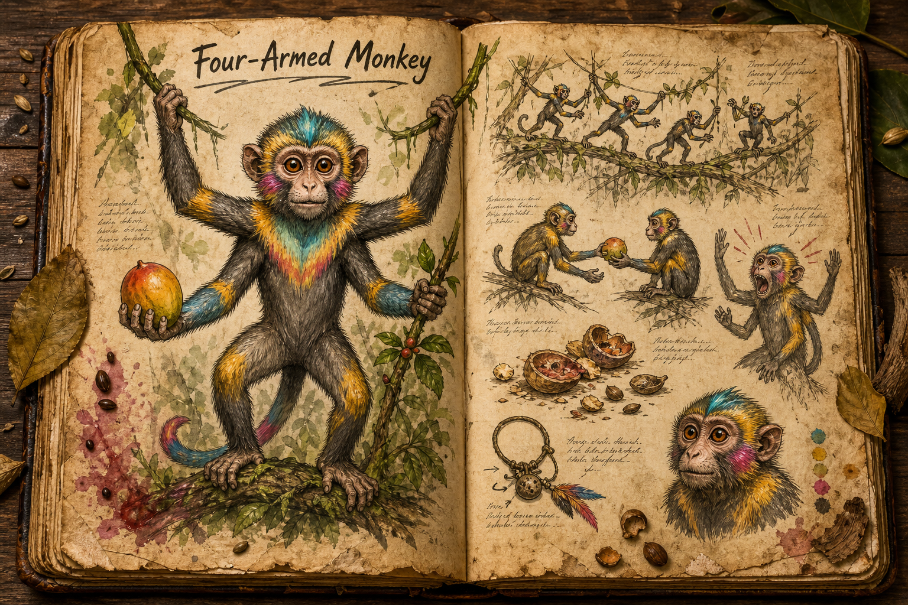

# Four-Armed Monkey

The Four-Armed Monkey is a small, bright jungle primate that lives in the canopy and survives by speed, attention, and numbers rather than aggression. It stands about 1 metre tall when upright, with four long, slim arms, large watchful eyes, and short fur marked in vivid mating colours. It is a passive creature by default, but an important one: where these monkeys feed, shout, and scatter, the [Jungle](../Biomes/Jungle.md) feels alive enough for players to read.

## Appearance and Movement

The creature's four arms are its defining silhouette. They are longer than its body, narrow but strong, and constantly in motion as it climbs, hangs, gathers fruit, picks insects from bark, or passes food between hands without slowing down. A troop moving through the canopy should look almost like a ripple of colour and limbs across the branches, visible for a moment and gone before a player can count every hand.

Its fur is short and clean, with bright patches used in mating display and social signalling. Different troops can lean toward different colour patterns, which gives regions of jungle a subtle local identity without needing named subspecies. Large eyes make the animal expressive and readable from below: curiosity, alarm, and attention are visible before the monkey bolts.

## Behaviour and Ecology

Four-Armed Monkeys eat fruit, insects, tender shoots, and the occasional egg taken from an unguarded nest. They travel in noisy troops that fall silent all at once when a predator enters the area, making them useful environmental signals. A player who learns their habits can read the canopy through them: relaxed chatter suggests ordinary wildlife, frantic movement suggests a disturbance, and sudden silence can mean something worse is already close.

They avoid combat almost completely. When threatened, the troop scatters upward and outward, using the extra arms to change direction through vines and branches faster than a ground-bound creature can track. A cornered monkey may bite or throw fruit, but the intended response is flight. This keeps the creature from becoming another disposable enemy and makes it part of the jungle's warning system instead.

## Gameplay Role

The Four-Armed Monkey is primarily ambience, ecology, and light utility. Hunters can follow troops toward fruiting trees, gatherers can use their alarm calls to avoid ambush predators, and careful players can spot their discarded shells and half-eaten fruit as signs of nearby food. Their bright fur and delicate bones may have minor [Crafting](../Crafting.md) uses, but the creature should be more valuable alive as information than dead as loot.

Trust-bonded individuals can become small companions under [Taming and Control](../Taming-and-control.md), not as combat pets but as alert animals that react to nearby movement, hidden predators, and strange sounds. They cannot carry equipment beyond tiny messages or trinkets, and their courage remains limited, which keeps them charming and useful without turning a passive jungle animal into a weapon.

## Story Hook

A jungle guide asks players to help free a troop of Four-Armed Monkeys from poacher snares before the canopy goes quiet for good. At first it seems like a small mercy job, but the trapped troop has stopped warning the area below, and a [Paralyzing Dragon](paralyzing-dragon.md) has begun using that silence to hunt along a busy gathering route.

See also: [Creatures index](../Creatures.md), the [Jungle](../Biomes/Jungle.md) it inhabits, [Taming and Control](../Taming-and-control.md) for trust-bonded companions, [Crafting](../Crafting.md) for its minor material uses, and the [Paralyzing Dragon](paralyzing-dragon.md) whose presence its alarm calls can reveal.

## Concept Drawing

## Draft

<!-- Raw notes land here. Add new content in any form; an AI assistant reworks it into the body above as finished prose, then clears what it has integrated. -->
