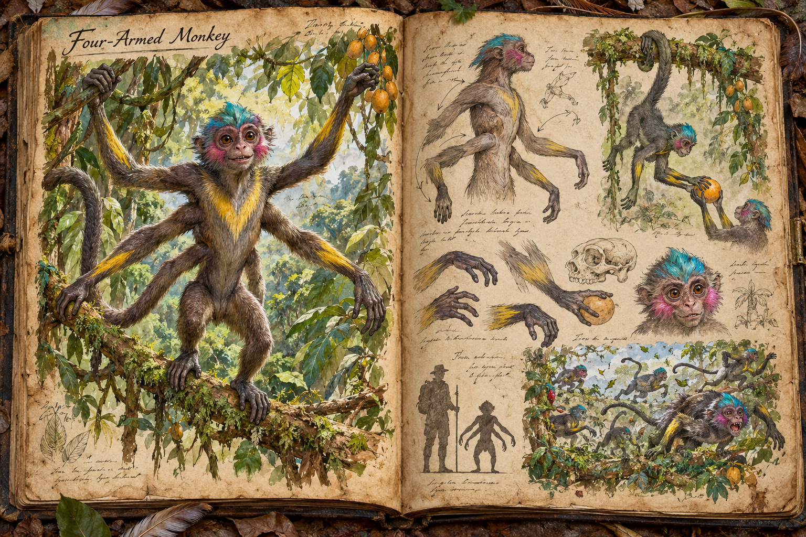
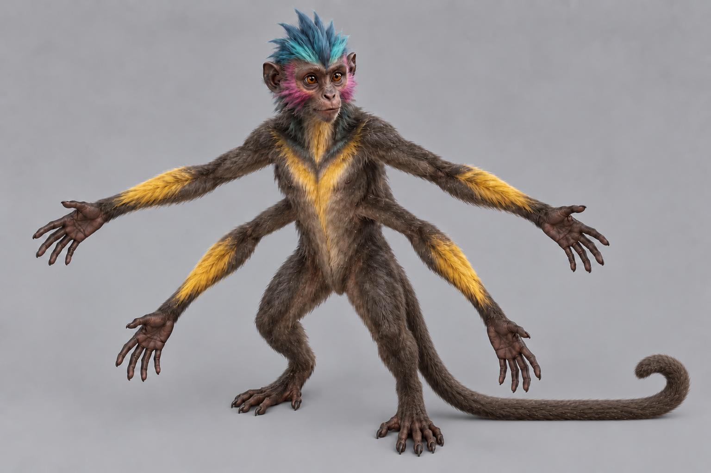

# Four-Armed Monkey

The Four-Armed Monkey is a small, bright jungle primate that lives in the canopy and survives by speed, attention, and numbers rather than aggression. It stands about 1 metre tall when upright, weighs 12 to 18 kilograms, and has six limbs, two legs and four slim arms in two stacked pairs, plus a prehensile tail about 1 metre long. It is passive by default and important to the [Jungle](../Biomes/Jungle.md): where these monkeys feed, shout, and scatter, the canopy is alive enough for players to read.

## Appearance and Visual Design

The four arms are the defining silhouette. The upper pair grows from the shoulders, and the lower pair from the middle of the torso, just below the ribcage; both pairs are the same length, longer than the body and narrow but strong, and they are constantly in motion as the monkey climbs, hangs, gathers fruit, picks insects from bark, or passes food from hand to hand without slowing down. The legs are short and sit folded beneath the body when the monkey hangs, and the tail wraps branches as a fifth grip. A monkey seldom comes to the ground: it swings, leaps, and climbs from branch to branch, and on the rare occasion it must cross open earth it scuttles on all four hands with the legs held up behind. A troop moving through the canopy looks like a ripple of colour and limbs across the branches, visible for a moment and gone before a player can count every hand.

The fur is short and clean, dark grey-brown across the back, limbs, and tail. The colour sits in a few fixed zones: a cyan crest standing up along the crown, magenta cheeks, and yellow flashes on the forearms and in a V across the chest. The patches are always present and brighten in the mating season, when they serve as display and social signal. Different troops lean toward different patterns, which gives regions of jungle a subtle local identity without any need for named subspecies. Large eyes make the animal expressive and readable from below: curiosity, alarm, and attention show before the monkey bolts.

## Behaviour and Ecology

Four-Armed Monkeys eat fruit, insects, tender shoots, and the occasional egg taken from an unguarded nest. They live in noisy troops of eight to twenty, and relaxed chatter is the sound of a safe stretch of canopy. Hunters can follow a troop toward fruiting trees, and discarded shells and half-eaten fruit below the branches mark where the food is.

They avoid combat almost completely. When threatened, the troop scatters upward and outward, using the extra arms to change direction through vines and branches faster than a ground-bound creature can track. A monkey bites or throws fruit only when it is cornered, and even then it hurts little; it wants to flee. This keeps it from becoming another disposable enemy.

## Close-Range Alarm

The monkeys' signal is about what is near. When a troop falls silent all at once, an ambush predator is close by, near enough to be hunting the ground the player stands on. Frantic movement overhead means a disturbance that has already started, and the troop's flight shows which way it is coming from. The [Birds](Birds.md) cover the other half of the same system. The [Paralyzing Dragon](paralyzing-dragon.md) is the predator the silence most often announces.

## Gameplay Role

The Four-Armed Monkey is ambience and ecology first. It is worth more alive than dead: a killed monkey drops only minor meat and fur for [Crafting](../Crafting.md), while a living troop tells gatherers where to work and where not to.

Through [Trust Bonding](../Taming-and-control.md) an individual can become a small companion. It is not a combat pet but an alert animal that chatters when a hidden predator or an unfamiliar sound is near. It cannot carry equipment, and its courage is limited: a frightened companion flees to the treetops and returns once it feels safe.

## Story Hook

A jungle guide asks players to help free a troop of Four-Armed Monkeys from poacher snares before the canopy goes quiet for good. At first it seems like a small mercy job, but the trapped troop has stopped warning the area below, and a [Paralyzing Dragon](paralyzing-dragon.md) has begun using that silence to hunt along a busy gathering route.

See also: [Creatures index](../Creatures.md), the [Jungle](../Biomes/Jungle.md) it inhabits, [Birds](Birds.md) for the other half of the warning system, [Taming and Control](../Taming-and-control.md) for trust-bonded companions, [Crafting](../Crafting.md) for its minor material uses, and the [Paralyzing Dragon](paralyzing-dragon.md) whose presence its silence can reveal.

## Concept Drawing

## Draft

<!-- Raw notes land here. Add new content in any form; an AI assistant reworks it into the body above as finished prose, then clears what it has integrated. -->
