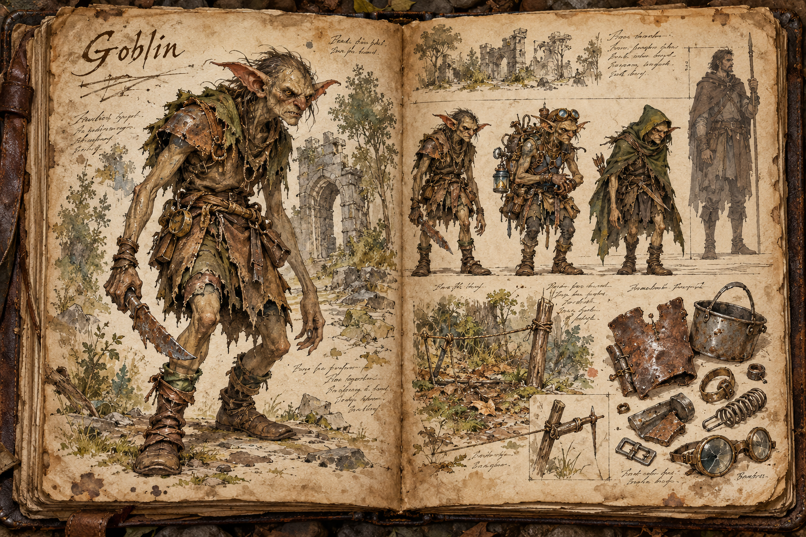
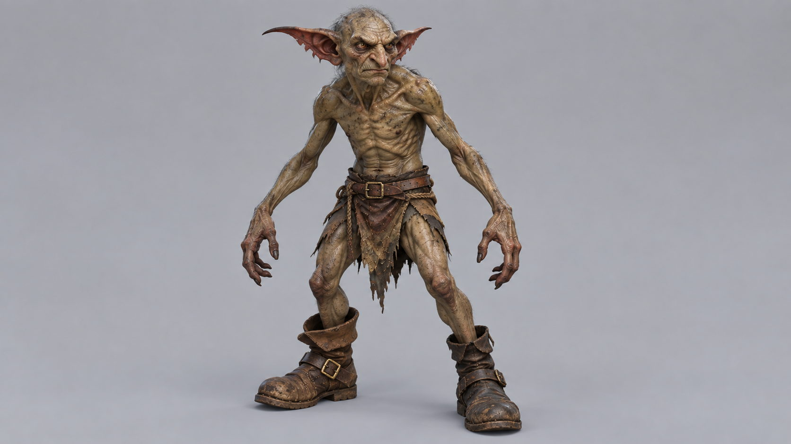

# Goblin

Goblins are opportunistic humanoids that thrive at the edges of civilisation. They live in loose tribes and scavenger bands of four to eight, raiding outposts, ambushing caravans and stripping ruins for anything of value. Individually they are weak, but a band plays its three roles against each other, and a player who treats a goblin encounter as one fight rather than as a trap with several parts pays for it.

## Appearance and Visual Design

A goblin is a hunched biped with two arms and two legs, standing 1,40 metres tall and weighing between 35 and 45 kilograms. The limbs are wiry and the fingers long, the shoulders sharp and the ears oversized, which keeps the silhouette readable in brush or a ruined doorway. It walks upright but hunched, and it runs in a crouch with its knuckles close to the ground, scrambling up walls, roof beams and trees with ease. The skin is a grey-brown olive that takes on the colour of the band's habitat: mossy green-brown in forest bands, dustier ochre where a band lives in dry country. The face is narrow, restless and expressive enough to show cowardice, greed, suspicion and sudden courage before a fight begins.

Three variants share that body and are told apart by kit. The Raider is the desperate front-line fighter in patched leather, rope belts and stolen boots that do not fit, carrying blades filed from broken tools and crude clubs. The Tinkerer is hung with clattering packs of springs, cracked lenses, wire and trap parts, and wears goggles pushed up on its forehead. The Scout is the lightest of the three, in a hooded cloak with a dagger at the belt, built to slip through undergrowth unseen. A successful band begins to show its thefts in mismatched human buckles, dwarven toolheads, elven cloth scraps and settlement-made cooking pots hammered into armour plates. Nothing on a goblin is merely decorative: everything looks stolen, repaired, or ready to be thrown away during a retreat.

## Behaviour and Encounter

Goblins prefer to attack only when they believe they hold the advantage, and each variant has its part in that. Raiders rush in with blades and clubs once the ground is prepared. Tinkerers set snares, spike pits and noise traps along the approach and throw fire pots from behind the line. Scouts spot a player first and run to warn the band, so a patrol that has been seen is rarely alone for long. The typical ambush draws the strongest defenders away with a deliberately obvious trail while the rest of the band circles back for the animals and food.

The traps give themselves away to a careful player: disturbed ground, tripwires, and a scattering of bait left a little too neatly. Killing the Scout before it can warn the band keeps a fight small, and a band breaks and flees once its leader or its Tinkerer falls. Retreating goblins scatter rather than fall back in order, dropping what they carry as they run.

Bands can also merge. Under a Goblin Chieftain, a larger and better-armed elite, several bands combine into a war-host, the regional power that [Setting and Lore](../Setting-and-lore.md) and [Guilds and Factions](../Guilds-and-factions.md) describe as holding ground against the realms. A war-host raids settlements rather than lone travellers, and it is the kind of threat that settlement defenders and friendly players meet together, as described in [Raids](../Raids.md).

## Role in the World

Goblins are common low- to mid-tier enemies, and their raids on small towns and early player bases are almost always motivated by theft: they go for targets they judge weak enough to overwhelm and carry off tools, food, weapons and anything else the tribe can use. They are also the steady source of scrap metal, springs, cloth, trap parts and stolen goods, which a player can recover from a dead band. Some tribes lean into tinkering and trade their cobbled-together mechanisms, which makes them useful contacts as well as threats.

## Story Hook

A forest outpost wakes to find its storehouse open, its tools gone, and a line of deliberately obvious tracks leading into the trees. The trail is bait, laid by a goblin band that wants the strongest defenders drawn away while the rest of the tribe circles back for the animals and food. A player who reads the raid as a theft rather than a battle can turn the trap around, recover the goods, and decide whether the tribe is desperate enough to bargain with or dangerous enough to break.

See also: [Creatures index](../Creatures.md), the [Forest](../Biomes/Forest.md) whose edges they raid, [Raids](../Raids.md), and [Reputation System](../Reputation-system.md).

## Concept Drawing

## Draft

<!-- Raw notes land here. Add new content in any form; an AI assistant reworks it into the body above as finished prose, then clears what it has integrated. -->
