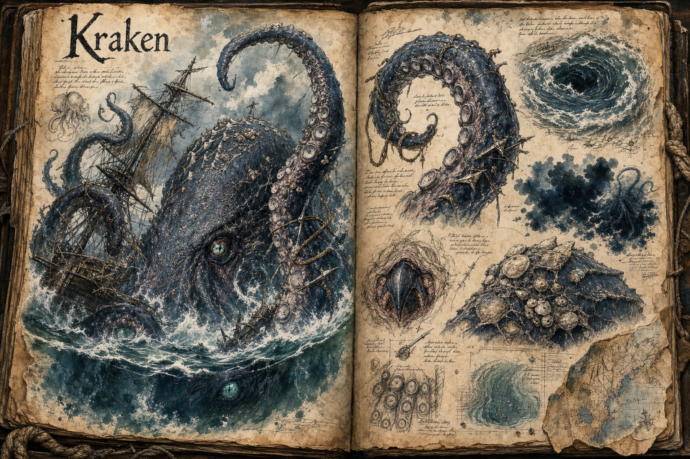
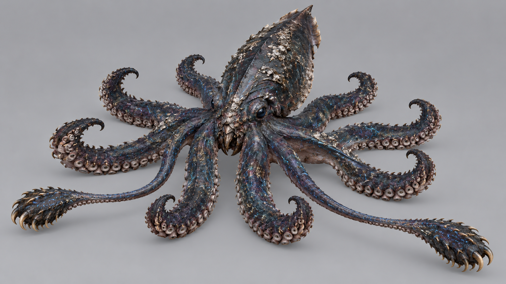

# Kraken

The Kraken is the apex predator of the [Deep Ocean](../Biomes/Deep-ocean.md), a colossal cephalopod that lives in the deepest trenches and rises beneath ships caught in a storm above its territory. Its body is about 20 metres long, eight arms trail about 35 metres from it, and two longer feeding tentacles reach about 50 metres, so a single Kraken can wrap a ship from bow to stern. It is a rare world-event encounter built for coordinated groups, and unlike the gentle giants of the bestiary, it hunts.

## Appearance and Visual Design

The Kraken feels like the deep ocean given intent. Most sightings reveal only pieces of it: an arm thicker than a mast sliding over the rail, a ridge of barnacled armour breaking the surface, or a vast eye opening beneath dark water before the hull starts to groan. Its body stays submerged throughout a fight, a long, plated mass holding a few metres under the swell with only its arms and one of its two eyes ever breaking the surface. Each eye is about 1,5 metres across, dark and unblinking. Beneath the body, at the centre of the ring of arms, sits a hooked beak that is seldom seen and never forgotten.

Its hide is blue-black and oil-slick in calm light, mottled with pale scars, shell growths, and mineral crust from years spent against trench walls. When storms gather, faint bioluminescent lines move under the skin, outlining the creature just enough to make the water around it feel inhabited by something impossibly large. The eight arms are muscular, asymmetrical, and heavy with suckers, hooks, old harpoon heads, rope, and fragments of wreckage dragged down from previous attacks, and each is about a metre and a half thick where it joins the body. The two feeding tentacles are longer, slimmer, and tipped with broad, hooked pads, and they are held back until the arms have the ship pinned. The body itself looks ancient rather than clean, with plated ridges, cracked shell masses, and ink-dark folds. A Kraken attack turns the sea itself into part of the creature's silhouette, with whirlpools, foam rings, and black ink clouds making it hard to tell where the monster ends and the storm begins.

## Behaviour and Encounter

The Kraken moves by jetting water through its mantle and pulling itself along with its arms, and it approaches a ship from below. The first sign is the sea itself: the ship's heading drifts as a current drags at the hull, and a whirlpool opens in its wake. The arms come next, rising out of the water to seize masts, rails, and rigging, and the tell for each seizure is the slap of a wet arm across the deck a moment before it closes. Every arm is a separate target, and cutting one frees whatever it held, so a crew that fights back with axes and boarding blades can peel the ship loose arm by arm. Left alone, the arms pull the ship down by the section they hold, and with enough of them attached it drags the whole vessel under.

Once the arms have pinned the ship, one of the two feeding tentacles rises and hovers over the deck, searching, and then snatches a crew member and lifts them over the side. The hovering is the warning, and a crew that watches for it can scatter or cut the tentacle short. When the Kraken commits to the kill, one eye rises to the surface to watch its prey, and that opening is the encounter's strike window: harpoons, cannons, and fire into the eye stun and wound it in ways no blade on the arms can match. A badly hurt Kraken lets go and sinks back into the trench rather than fight to the death, so the hunt ends by driving it off, not by finishing it at its strongest.

The fight is built for 10 to 20 players working across one to three ships, so the ship itself is a resource as much as a stake: gun crews, harpoon teams, and hands with axes each have a place, and a crew that cannot cover every arm loses the hull. A ship that sinks takes its cargo and stores down with it and puts its crew into open water, where survivors swim for the floating wreckage. What remains of the hull drifts in time toward the [Coast](../Biomes/Coast.md) and its wreck fields, which is also where survivors and victims wash up.

## Spawn and Territory

The Kraken appears over its trench when a storm is raging and ships linger in the water above it. Both conditions are required, which keeps it readable: a captain who sees the storm building and the trench on the chart has a clear signal to leave or to prepare. There is one Kraken per region, and after an encounter it retreats to the trench for a long period before it can appear again. It does not follow a ship into shallow water, so the coast is safe from it.

## Rewards and Role

A Kraken hunt pays in materials found nowhere else. The beak, the ink sacs, and the sucker hooks from the arms and feeding tentacles feed ship upgrades, deep-sea equipment, and high-tier alchemy, and the rare trench materials caught in its crusted hide, pressure-hardened shell and mana-rich mineral, come to the surface only when the Kraken itself rises. The wreckage tangled in its arms adds salvageable hull plating and cargo from earlier victims. The long wait between appearances keeps it a prestige hunt rather than a farmed target.

Because it takes many players and several ships to bring one down, the Kraken works as an emergent event for the whole sea. Coastal factions, fisher guilds, naval traders, and settlement leaders have reasons to post warnings, bounties, and recovery quests after a sighting, and [Raids](../Raids.md) covers the wider scale of this kind of world event.

## Story Hook

A coastal settlement asks players to salvage the drifted remains of a ship the Kraken took. The first expedition seems like ordinary salvage work, but the deeper clues turn up sounding records of the trench, damaged warning buoys, and a coming storm that will stir the creature out of its trench once more.

See also: [Creatures index](../Creatures.md), the [Deep Ocean](../Biomes/Deep-ocean.md) it rules, the [Coast](../Biomes/Coast.md) and its wreck fields, [Travel and Mounts](../Travel-and-mounts.md) for the ships it threatens, [Weather, Time, and Seasons](../Weather-time-and-seasons.md) for the storms that stir it, and [Raids](../Raids.md) for its world-event scale.

## Concept Drawing

## Draft

<!-- Raw notes land here. Add new content in any form; an AI assistant reworks it into the body above as finished prose, then clears what it has integrated. -->
