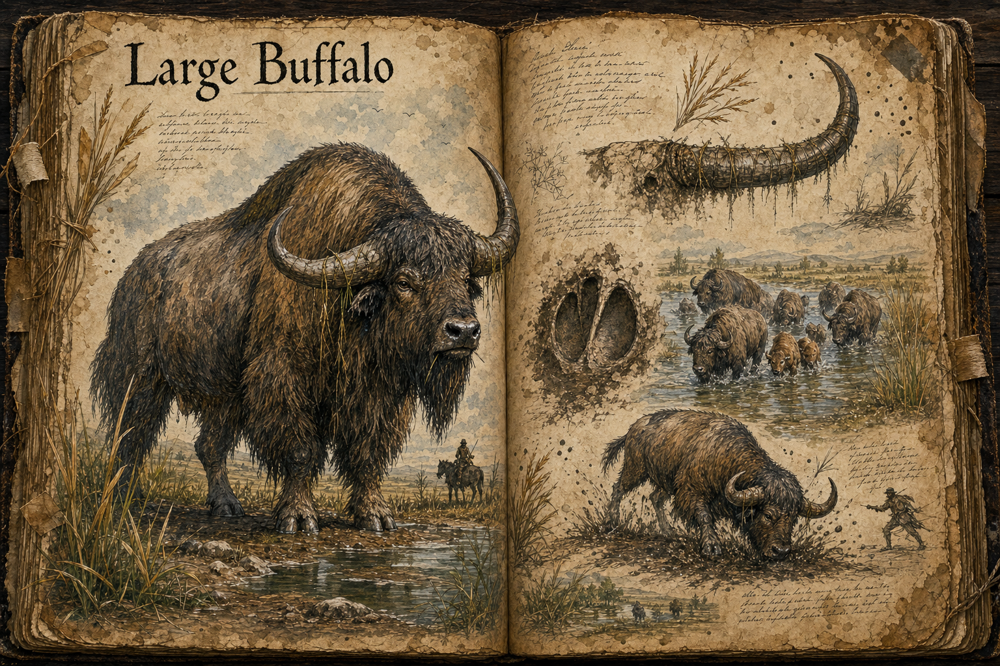

# Large Buffalo

Large Buffalo are docile giants of the [Plains](../Biomes/Plains.md), roaming the grassland rivers in slow herds and giving the beginner biome a creature that feels enormous without being hostile. They stand around 4 metres high at the shoulder, with shaggy highland-cattle coats, heavy bodies, and horns broad enough to make even a calm animal look like a siege engine at rest. Their purpose is not to threaten the player on sight, but to make the world feel inhabited by creatures too large to ignore and too peaceful to treat as ordinary enemies.

## Appearance and Visual Design

A Large Buffalo reads first through silhouette. Its shoulders rise higher than a mounted rider, forming a muscular hump beneath a long curtain of fur that hangs over the neck, chest, belly, and legs. The coat is thick, wind-tangled, and river-damp, usually coloured in muted browns, black, ochre, and pale cream, with older animals carrying grey through the muzzle and along the spine. When a herd moves through tall grass, the bodies can vanish behind the reeds while the horn arcs and shaggy backs continue above them like slow-moving pieces of the landscape.

The horns are the visual anchor. They sweep wide from the skull before curving forward and upward, broad enough that a mature bull must turn its head sideways to push through dense riverside brush. Scratches, mud, flowering grass, and dangling reed stems collect along the horn ridges, making each animal look weathered by the same watercourses it follows. The face stays gentle despite the scale: dark watchful eyes, a wet nose, and slow chewing motions keep the creature from reading as a monster unless it has been provoked.

## Habitat and Temperament

Large Buffalo favour the river oases of the plains, where fresh water, lush grass, and soft mud give them everything they need. They travel in small herds along the banks, crossing the same fords season after season and leaving behind trampled paths that players can use as natural routes through the grass. A traveller who sees buffalo grazing nearby can usually assume that the water is safe, the ground is open, and no major predator has disturbed the area recently.

Their temperament is calm, but not passive. A herd gives warnings before it becomes dangerous: heads lift, calves are pushed inward, hooves stamp mud from the bank, and the oldest animals lower their horns toward the source of trouble. Players who respect those signals can pass close, gather along the same river, or shelter on the far side of the herd without starting a fight. Players who attack, crowd a calf, or try to drive the herd from its water risk a stampede that is more environmental disaster than duel. A charging Large Buffalo is not agile, but anything caught in its path is thrown, crushed, or shoved into the river.

## Gameplay Role

The Large Buffalo gives the plains a peaceful spectacle and a practical teaching creature. It shows new players that size does not always mean aggression, while still making the consequences of reckless behaviour clear. Its herd can be used as a landmark, a sign of nearby water, or temporary cover from line of sight, but the same herd becomes a hazard if startled by combat, fire, predators, or careless riding.

For hunters and crafters, the creature is valuable because of scale rather than rarity. One animal can provide a great quantity of meat, hide, horn, bone, and coarse fibre, all useful to the survival and [Crafting](../Crafting.md) loops, but bringing one down never feels like harvesting a passive node. The hunt is loud, messy, and morally legible in a beginner-friendly biome; wounded animals bellow, nearby buffalo react, and a careless party can turn an easy-looking resource run into a riverbank panic.

The buffalo also has a place in [Taming and Control](../Taming-and-control.md), especially for players who want a slow hauling beast rather than a fast mount. Young animals raised through patient care can become powerful pack creatures for plains travel and river settlement work, but even a bonded buffalo keeps its instincts. It will not willingly charge into certain death, cross unstable bridges, or abandon a frightened herd without a strong relationship to the handler.

## Story Hook

A riverside settlement has always lived beside the same buffalo herd, using its trails, drinking from the fords it keeps open, and treating the oldest horned matriarch as a sign that the season will be gentle. When poachers wound her for the horn trade, the herd refuses to leave the settlement's waterline and grows more agitated by the day. The players can hunt the poachers, calm and treat the wounded animal, drive the herd away by force, or exploit the chaos before the first real stampede tears through the river farms.

See also: [Creatures index](../Creatures.md), the [Plains](../Biomes/Plains.md) it roams, [Crafting](../Crafting.md) for the materials its body can provide, and [Taming and Control](../Taming-and-control.md) for bonding with powerful beasts.

## Concept Drawing

## Draft

<!-- Raw notes land here. Add new content in any form; an AI assistant reworks it into the body above as finished prose, then clears what it has integrated. -->
