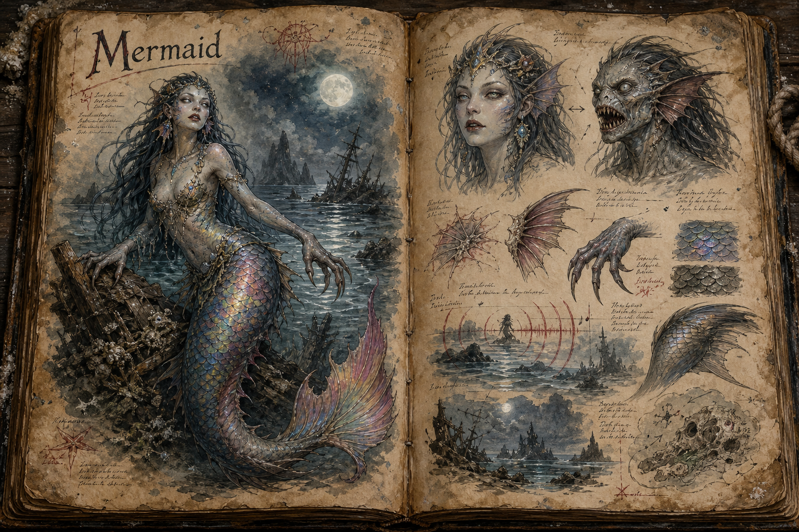

# Mermaid

The Mermaid is an intelligent sea predator that turns beauty, music, and loneliness into weapons. It haunts reefs, wreck fields, coves, and dark water near shipping routes, using its song to draw sailors and divers away from safety before dragging them below. Where the [Kraken](Kraken.md) makes the ocean terrifying through scale, the Mermaid makes it terrifying through trust: one voice in the fog can be more dangerous than a storm.

## Appearance and Glamour

A Mermaid seen through its charm appears as an idealized woman with a fish tail, luminous skin, and rainbow-bright scales that catch moonlight and lantern light beautifully. The illusion is part of the threat. A charmed victim does not read the creature as monstrous or dangerous, and may ignore warning signs that would be obvious to everyone else on the ship.

When the charm breaks, the false beauty falls away at once. The humanlike upper body becomes a lean, predatory fish-humanoid form with a wide mouth, gill slits along the sides of the chest, pallid eyes, and grey, slick skin. The tail loses its rainbow sheen and resolves into dull, cold scale and muscle built for sudden movement in deep water. This contrast should be strong in play: one player may see a beautiful figure calling from the waves while another sees the thing already coiling to strike.

## Siren Song and Resistance

The Mermaid's song is a magical compulsion that works best over open water, at night, in fog, or during the quiet after a storm. Anyone who hears it clearly can be drawn toward the source, and the danger increases when a target is isolated on watch, already exhausted, or leaning over the rail to search the dark. High [Player Progression](../Player.md) investment in Intelligence or Wisdom, sound-muffling equipment, protective charms, or prepared [Magic](../Magic.md) can resist the effect, turning the encounter from a helpless lure into a tense contest of preparation.

The charm is not absolute, and that is where the encounter becomes interesting. Crew members who are not affected can physically restrain the charmed, block the sound, interrupt the singer, or steer the ship away before the victim reaches the edge. Once a Mermaid realizes its song is failing, it usually changes behaviour immediately: a cautious one dives and waits for a better chance, while a cornered or hungry one lashes out with claws, teeth, and the strength of its tail before fleeing into depth.

## Intelligence and Behaviour

Mermaids are as intelligent as humans, though they rarely reveal it unless speech gives them an advantage. They can use the common tongue, mimic distress calls, repeat names overheard from a deck, and bargain long enough to move prey into a worse position. A Mermaid encounter should never feel like a simple animal attack; even when the creature is silent, it is reading fear, distance, light, and who on the ship is listening too closely.

The species is all female and reproduces through captured male victims, a grim biological fact handled as lore, aftermath, and missing-person horror rather than depicted content. That boundary keeps the creature disturbing without turning its darkest material into spectacle, in line with [Content and Tone](../Content-and-tone.md). Coastal communities understand enough to fear lone voices at sea, and their taboos around night fishing, funeral bells, and watch rotations all grow from that fear.

## Gameplay Role

The Mermaid gives sea travel a close-range threat that tests perception, party discipline, and equipment rather than hull strength. It can appear around wrecks, isolated rocks, moonlit shallows, and diving sites, especially where players expect loot but not a full naval battle. The best counterplay is practical: travel in pairs, rotate night watch, keep sound protection ready, and treat a beautiful voice in empty water as a warning rather than an invitation.

Rewards should support the same loop. Gill membranes, dull true-scales, and preserved voice organs can feed alchemy, water-breathing equipment, charm-resistance gear, or sound-based spell research, while objects found in a Mermaid's lair tell the story of crews that did not resist in time. The creature is dangerous enough to make sailors cautious, but common enough that experienced crews can learn rituals and equipment habits around it.

## Story Hook

A line of coastal beacons remains lit, yet ships keep vanishing within sight of shore. The only survivor from the latest wreck is found walking inland at dawn, soaked, smiling, and humming a melody he cannot stop repeating. Players who trace the wreckage find the cargo arranged in a tide cave like offerings, and a Mermaid who knows the names of every sailor still missing.

See also: [Creatures index](../Creatures.md), [Travel and Mounts](../Travel-and-mounts.md) for the sea routes it threatens, [Magic](../Magic.md) for charm counters, and [Content and Tone](../Content-and-tone.md) for the mature-content boundary around its darker lore.

## Concept Drawing

## Draft

<!-- Raw notes land here. Add new content in any form; an AI assistant reworks it into the body above as finished prose, then clears what it has integrated. -->
