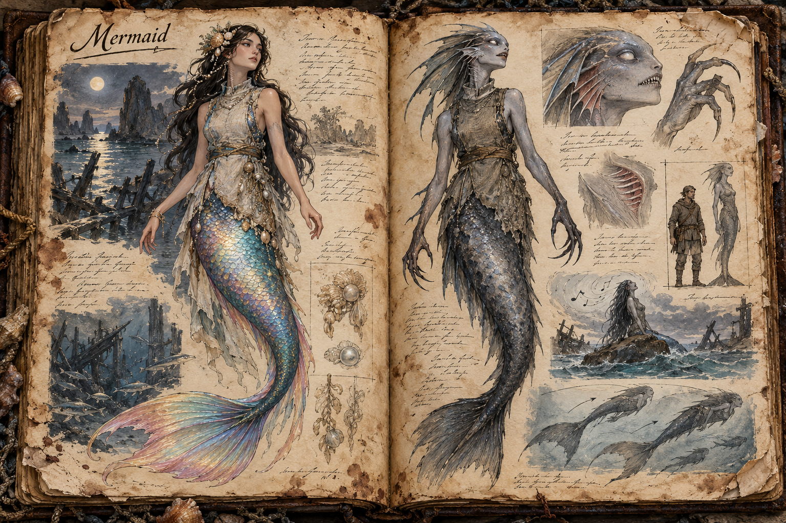
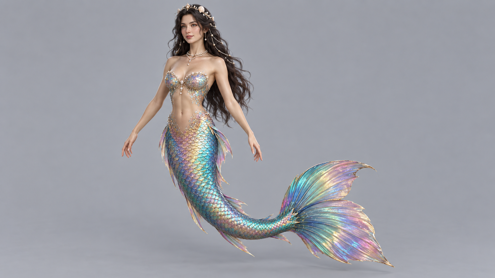
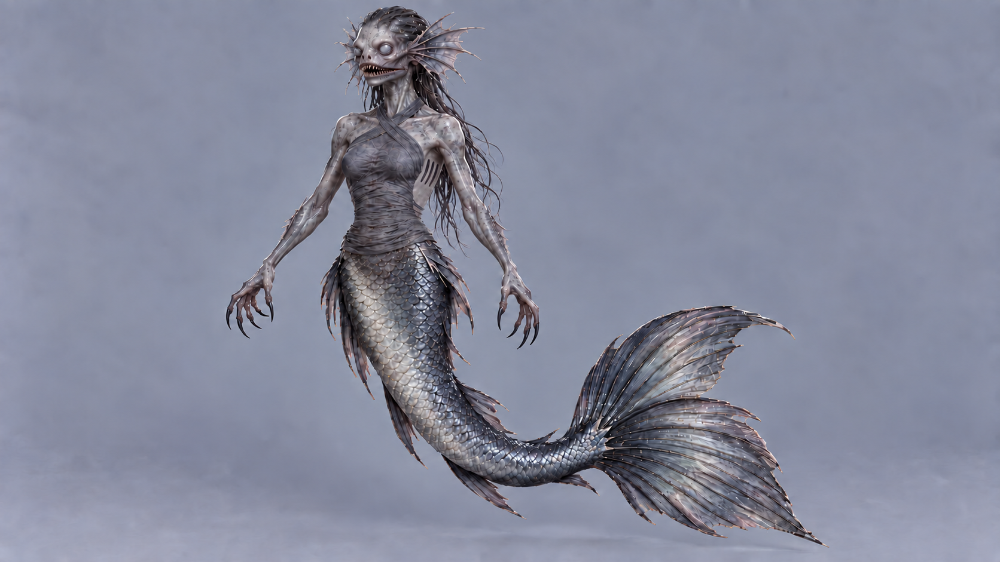

# Mermaid

The Mermaid is an intelligent sea predator that turns beauty, music, and loneliness into weapons. It measures about 2,5 metres from head to tail fin, weighs around 90 kilograms, and has a humanoid upper body of ordinary human size joined to a long fish tail. It has two arms, no legs, and no wings. It haunts the reefs, coves, sea stacks, and wreck fields of the [Coast](../Biomes/Coast.md), using its song to draw sailors and divers away from safety before dragging them below. Where the [Kraken](Kraken.md) makes the ocean terrifying through scale, the Mermaid makes it terrifying through trust: one voice in the fog can be more dangerous than a storm.

## Appearance and Glamour

A Mermaid seen through its charm appears as an idealized woman with long dark hair and a fish tail, luminous skin, and rainbow-bright scales that catch moonlight and lantern light beautifully. Pearl strings and small crowns of shell sit in the hair and at the throat. The illusion is part of the threat. A charmed victim does not read the creature as monstrous or dangerous, and ignores warning signs that would be obvious to everyone else on the ship.

The true form is the opposite of the glamour. The humanlike upper body is lean and predatory, the skin is grey and slick, the mouth is wide and full of fine teeth, the eyes are pale and lidless, and gill slits run along the sides of the chest. Long, curved claws tip the fingers, and a frill of thin fins spreads from each side of the head. The tail loses its rainbow sheen and resolves into dull, cold scale over heavy muscle built for sudden movement in deep water. Players who resist the song through Wisdom, the status-effect resistance described in [Player Progression](../Player.md), see this form from the start, so one player watches a beautiful figure calling from the waves while another sees the thing already coiling to strike.

## Movement

A Mermaid swims with its tail and steers with its arms, moving with surprising speed at the surface and in the depths alike. It can haul itself onto a wreck or a rock by its arms, where it perches to sing, but it cannot climb onto a ship's deck: the rail is the limit of its reach, and its attacks come from the waterline or from a rock or wreck it has hauled itself onto.

## Siren Song and Resistance

The song is a magical compulsion that works best over open water, at night, in fog, or during the quiet after a storm. A player who hears it clearly and fails to resist is charmed, and a charmed player walks toward the water, leans over the rail, or wades in, pulled toward the singer without any sense of danger. The risk is greatest when a target is alone on watch, already exhausted, or searching the dark. Once the victim is within reach, the Mermaid seizes them and drags them under, where they begin to drown. The drowning leaves a rescue window, and a crew that reacts fast enough can still pull a victim back.

The charm is not absolute, and that is where the encounter becomes interesting. Damage to the charmed player, an ally who shakes them out of it, or blocking the ears against the sound breaks it, and protective charms and prepared [Magic](../Magic.md) help resist it. Crew members who are not affected can also physically restrain the charmed, interrupt the singer, or steer the ship away before the victim reaches the edge. A Mermaid whose song fails dives and waits for a better chance; one that is cornered or hungry lashes out with claws, teeth, and the strength of its tail before it flees into depth.

## Intelligence and Behaviour

Mermaids are as intelligent as humans, though they rarely reveal it unless speech gives them an advantage. They can use the common tongue, mimic distress calls, repeat names overheard from a deck, and bargain long enough to move prey into a worse position. A Mermaid encounter never feels like a simple animal attack; even when the creature is silent, it is reading fear, distance, light, and who on the ship is listening too closely. Most Mermaids live alone, each holding a stretch of reef or cove as its own, and only at the wreck fields do they gather in loose groups, drawn together by the steady supply of victims.

The species is all female and reproduces through captured male victims, a grim biological fact handled as lore, aftermath, and missing-person horror rather than depicted content. That boundary keeps the creature disturbing without turning its darkest material into spectacle, in line with [Content and Tone](../Content-and-tone.md). Coastal communities understand enough to fear lone voices at sea, and their taboos around night fishing, funeral bells, and watch rotations all grow from that fear.

## Gameplay Role

The Mermaid gives sea travel a close-range threat that tests perception, party discipline, and equipment rather than hull strength. It appears around wrecks, isolated rocks, moonlit shallows, and diving sites, especially where players expect loot but not a fight. The best counterplay is practical: travel in pairs, rotate night watch, keep sound protection ready, and treat a beautiful voice in empty water as a warning rather than an invitation.

A slain Mermaid yields its scales, and its lair holds pearls. The scales feed alchemy, water-breathing equipment, and charm-resistance gear, and the lair's pearls and other belongings tell the story of crews that did not resist in time. The creature is dangerous enough to make sailors cautious, but common enough that experienced crews learn rituals and equipment habits around it.

## Story Hook

A line of coastal beacons remains lit, yet ships keep vanishing within sight of shore. The only survivor from the latest wreck is found walking inland at dawn, soaked, smiling, and humming a melody he cannot stop repeating. Players who trace the wreckage find the cargo arranged in a tide cave like offerings, and a Mermaid who knows the names of every sailor still missing.

See also: [Creatures index](../Creatures.md), the [Coast](../Biomes/Coast.md) it haunts, [Travel and Mounts](../Travel-and-mounts.md) for the sea routes it threatens, [Magic](../Magic.md) for charm counters, and [Content and Tone](../Content-and-tone.md) for the mature-content boundary around its darker lore.

## Concept Drawing

## Draft

<!-- Raw notes land here. Add new content in any form; an AI assistant reworks it into the body above as finished prose, then clears what it has integrated. -->
