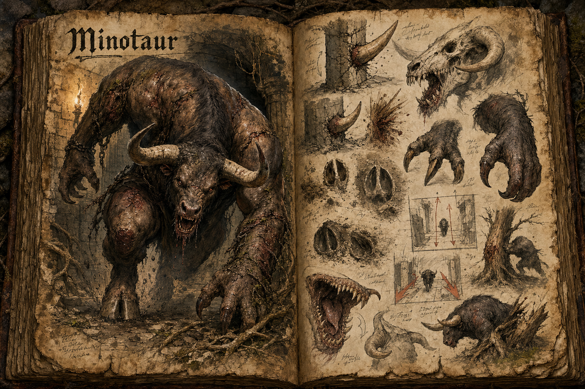

# Minotaur

The Minotaur is a brutal beast-humanoid found in deep forests, overgrown ruins, and the heavier chambers of old [Dungeons](../Structures/Dungeons.md). It is not the armed, armoured labyrinth soldier of some traditions, but a raw physical monster that kills with hooves, claws, horns, weight, and bite. Its role is to make enclosed spaces and dense woodland feel physically unsafe: if a player hears it breathing in the dark, the question is not whether it can hurt them, but whether there is enough room to survive the charge.

## Appearance and Visual Design

A Minotaur has the broad torso and heavy shoulders of a humanoid fused with the head, neck, hooves, and animal force of a bull. Its legs end in split hooves built for impact, while its hands are large, clawed, and rough enough to rake bark from trees or stone dust from a dungeon wall. The jaw is powerful and ugly, with teeth suited to tearing rather than clean bites, and the horns are not decorative trophies but primary weapons.

The creature should read as bestial rather than martial. It does not wear forged armour, carry an axe, or stand like a trained warrior waiting for a duel. Scars, caked mud, broken horn tips, old trap wounds, and scraps of vine or chain caught in its hide can tell its history, but its danger comes from muscle and fury. In a dungeon it may drag debris in its wake or break pieces from the architecture, yet those objects remain environmental damage, not equipment.

## Territory and Behaviour

Minotaurs are highly aggressive and territorial. In forests they favour ravines, root-choked hollows, ruined thresholds, and game trails where their bulk can burst from cover at close range. In dungeons they are most at home in maze-like floors, prison halls, and chambers wide enough for a charge but narrow enough that players cannot simply scatter. They respond strongly to scent, vibration, and sound, making stealth possible but risky.

Their intelligence is predatory rather than conversational. A Minotaur can learn a route, remember where prey escaped, and feint retreat toward a better charge lane, but it does not negotiate or fight with human discipline. Once enraged it smashes obstacles, drives targets into corners, and uses the environment as a weapon by throwing bodies into trees, pillars, doors, or walls.

## Combat Role

The Minotaur is a space-control bruiser. It punishes parties that stack together, panic in corridors, or try to trade blows in front of it, while rewarding players who manage angle, footing, and obstruction. A good fight against one is built around reading the charge, baiting it into a miss, using pillars or trees to break momentum, and striking during the short recovery before it turns again.

Its claws and bite make close contact dangerous even after the initial impact. Shields can blunt a charge but should not trivialize it, and a lone player caught in open ground is in real trouble. Useful rewards include horn, hide, hoof, sinew, and dense bone, materials suited to heavy armour, impact-resistant shields, warhorns, and brutal melee weapon fittings through [Crafting](../Crafting.md).

## Story Hook

Hunters in a forest settlement find their marked trail trees split open and their snares crushed flat, all leading toward a ruin that was supposed to be empty. Beneath it, a dungeon floor has opened into a root-filled maze, and a Minotaur has claimed both sides of the threshold as one territory. Players can hunt it in the trees, descend after it into the dungeon, or use the passage between the two spaces to turn its charge against itself.

See also: [Creatures index](../Creatures.md), the [Forest](../Biomes/Forest.md) it stalks, [Dungeons](../Structures/Dungeons.md) that can hold it, and [Crafting](../Crafting.md) for the heavy materials its body can provide.

## Concept Drawing

## Draft

<!-- Raw notes land here. Add new content in any form; an AI assistant reworks it into the body above as finished prose, then clears what it has integrated. -->
