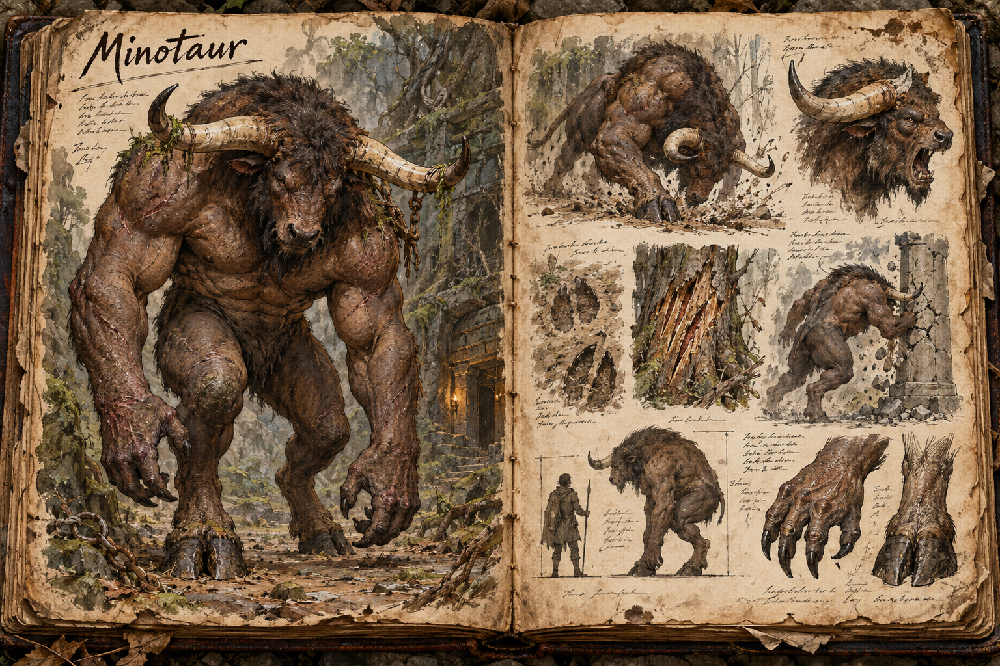

# Minotaur

The Minotaur is a brutal, bull-headed beast found in forest ravines, overgrown ruins and the heavier chambers of old [Dungeons](../Structures/Dungeons.md). It is not the armed, armoured labyrinth soldier of some traditions but a raw physical monster that kills with horns, hooves, claws, weight and bite. It is an elite encounter, and only one holds any given ravine or maze. Its role is to make enclosed spaces and dense woodland feel physically unsafe: if a player hears it breathing in the dark, the question is not whether it can hurt them, but whether there is enough room to survive the charge.

## Appearance and Visual Design

A Minotaur stands 2,80 metres tall when it rises to its full height and about 2,40 metres in its usual hunch, and it weighs between 500 and 600 kilograms. It is a biped with two hooved legs and two long, heavily muscled arms ending in large clawed hands, which reach nearly to the knees when it stoops. The torso and shoulders are humanoid and enormous; the neck, head and horns are a bull's. The jaw is powerful and ugly, with teeth made for tearing, and the horns sweep forward and out to a span of about 1,50 metres. They are its primary weapons, not trophies. The hooves are split and built for impact.

The body is bare dark brown-grey hide, thick and scarred across the torso and limbs, with short dark fur over the head, neck and shoulders. The horns are pale ivory, darkening toward the tips, and the hooves and claws are near black. It wears nothing and carries nothing. Its history shows on the body instead: broken horn tips, old trap wounds, caked mud, and scraps of vine or rotted chain caught in the hide. In a dungeon it drags debris in its wake and breaks pieces from the architecture, but those remain environmental damage rather than equipment.

## Movement and Territory

The Minotaur walks in a low, rolling hunch with its arms swinging close to the ground, and covers open ground in a head-down charge on its two legs. It favours ravines, root-choked hollows, ruined thresholds and game trails in the [Forest](../Biomes/Forest.md), where its bulk can burst from cover at close range, and in dungeons it is at home in maze-like floors, prison halls and chambers wide enough for a charge but narrow enough that players cannot scatter. It leaves deep, cloven hoof prints and horn-gouged bark along its routes, and a player who reads those marks knows a territory's owner long before meeting it. It responds strongly to scent, vibration and sound, which makes stealth possible but risky.

Its intelligence is predatory rather than conversational. It learns a route, remembers where prey escaped and feints a retreat toward a better charge lane, but it does not negotiate and does not fight with human discipline. Once enraged it smashes obstacles, drives targets into corners, and throws bodies against trees, pillars, doors and walls.

## Combat Role

The Minotaur is a space-control bruiser. It punishes parties that stack together, panic in corridors or try to trade blows in front of it, and it rewards players who manage angle, footing and obstruction. Its attacks are the charge, a gore with the horns, a sweeping claw swipe, and a grab-and-throw that flings a caught player into the nearest wall. Before a charge it paws the ground and lowers its head, and that pause is the window to move. A player who sidesteps the charge and lets it hit a pillar, a tree trunk or a wall leaves it briefly dazed, and the dazed Minotaur is the best opening a fight offers.

A good fight against one is built around reading that tell, baiting the charge into a miss, using pillars and trees to break its momentum, and striking in the daze before it turns again. A shield blunts a charge without cancelling it, and a lone player caught in open ground is in serious trouble because claws and bite keep the threat alive after the first impact.

A dead Minotaur leaves horns, hide and heavy bone, materials for heavy armour, impact-resistant shields, warhorns and brutal weapon fittings through [Crafting](../Crafting.md).

## Story Hook

Hunters in a forest settlement find their marked trail trees split open and their snares crushed flat, all leading toward a ruin that was supposed to be empty. Beneath it, a dungeon floor has opened into a root-filled maze, and a Minotaur has claimed both sides of the threshold as one territory. Players can hunt it in the trees, descend after it into the dungeon, or use the passage between the two spaces to turn its charge against itself.

See also: [Creatures index](../Creatures.md), the [Forest](../Biomes/Forest.md) it stalks, [Dungeons](../Structures/Dungeons.md) that can hold it, and [Crafting](../Crafting.md) for the heavy materials its body provides.

## Concept Drawing

## Inspiration

The design follows the beast minotaur in the [Greyhawk illustration](https://www.greyhawkonline.com/greyhawkwiki/images/9/97/Minotaur.jpg), a brutal animal that fights with claws, raw strength and bite rather than a weapon. This version keeps that bestial, unarmed and unarmoured character and adds the charge, the tell and the dazed recovery that make it a readable fight, along with a home in both forest ravines and dungeon mazes.

## Draft

<!-- Raw notes land here. Add new content in any form; an AI assistant reworks it into the body above as finished prose, then clears what it has integrated. -->
