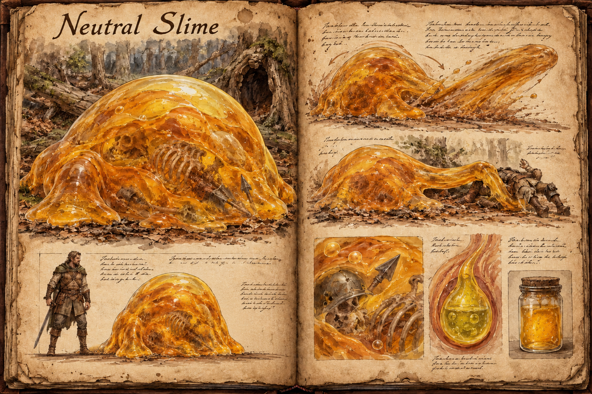

# Neutral Slime

Leave a neutral slime alone and it leaves you alone; hit it once and it does not let go. This heavy, warm-toned mass, about 2 metres across and 1,5 metres tall, is what a passive slime becomes once meat and carrion enter its diet, and from there its only way onward is toward the [Aggressive Slime](Aggressive-slime.md). It is the form most players meet first as a real danger, because it sits quietly beside the very kills that make it worth investigating.

## Appearance and Visual Design

A neutral slime sits as a dense dome, about as wide as a small cart and as tall as a player's chest, with thick amber layers of gel where the passive form was clear. Slow bubbles rise through the body and burst at the surface, and the bones, hide scraps, and half-dissolved gear of past meals hang suspended in it, far more than in a passive slime. It moves in elastic surges, the whole body drawing back and then flowing forward in a heavy lunge, and it extends only a few thick pseudopods, used to grip prey and drag food into its mass. Its orange and yellow tones make it easy to pick out across a clearing, and the weight of its movement reads as something to keep away from.

## Encounter

A neutral slime is defensive by nature. It ignores players who keep their distance and never hunts, but it retaliates the moment it is struck, engulfing its attacker and holding on. Its bubbling quickens and the body draws back before each surge, which gives a player a moment to step aside. The engulfing hold is what makes it serious: the corrosion described in [Slime](Slime.md) can cost a player their gear even in a fight they win.

Standing off with the heavy, fiery, and salted answers from the hub works best, while the cheapest option costs nothing, since a player who needs to pass can simply walk around it. A kill yields gel and the acid sacs the body has built up, a caustic reagent for alchemy and for treating weapons.

A neutral slime is usually found in the hollows of the [Forest](../Biomes/Forest.md), near the carcasses and kills that turned it.

## Story Hook

Two hunters tracking a wounded deer into a forest hollow find the carcass already inside a neutral slime, half dissolved, with their own arrowhead drifting in the gel beside it. The hollow is the only way through to the herd they were following, and arrows are wasted on the thing. Somebody has to decide whether to lure the slime off the trail, burn it out, or leave it feeding and trust it to stay put.

See also: [Creatures index](../Creatures.md), [Slime](Slime.md), [Passive Slime](Passive-slime.md), [Aggressive Slime](Aggressive-slime.md), and the [Forest](../Biomes/Forest.md) where it feeds.

## Concept Drawing

## Draft

<!-- Raw notes land here. Add new content in any form; an AI assistant reworks it into the body above as finished prose, then clears what it has integrated. -->
