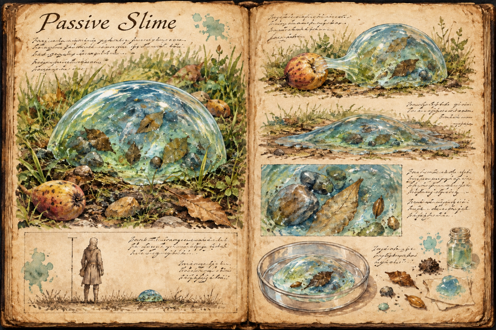
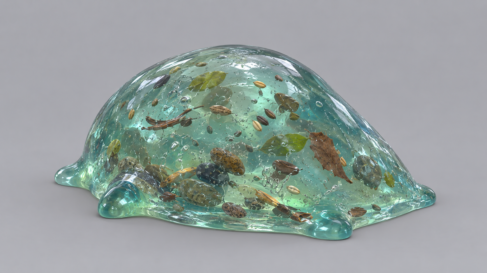

# Passive Slime

Slow, translucent, and forever sliding out of the way, the Passive Slime is the gentlest form of the [Slime](Slime.md) family: a blob between 0,3 and 0,8 metres across that creeps through the grass and flees from anything that approaches it. It passes easily for harmless ambience, and it is harmless for as long as it stays on a diet of plants; what it becomes depends on what it is fed next.

## Appearance and Visual Design

A passive slime is a low, rounded dome of clear gel, about the size of a serving bowl at its smallest and of a washing basin at its largest. The gel is tinted cool blue and green and is clear enough to show the stones, leaf fragments, and seeds it has swallowed, which hang inside it like objects in pond water. It moves by a slow creep, the whole body flowing forward a few handspans at a time, and pushes out small pseudopods to test the ground ahead and to pull food in. Its edges quiver constantly, and a slime that senses a threat flattens, draws in its pseudopods, and oozes away through the grass as fast as it can, which is not fast.

## Behaviour and Encounter

A passive slime never attacks. It avoids players and other creatures alike and goes out of its way to put distance between itself and anything that moves, so the usual encounter is a player stumbling over one in the grass and watching it slide off. Wandering passive slimes are a common sight on the open [Plains](../Biomes/Plains.md), where they graze on fallen fruit and leaf litter.

Killing one is safe and pays little: a few heavy blunt blows burst it and leave gel, the family's base crafting and alchemy material, and nothing else. Left alive, it is where cultivation starts. Whatever it is fed from here on decides which form it grows into, as [Slime](Slime.md) lays out, and a player who notices the cool blue clouding can stop feeding at any point and keep it as it is.

## Story Hook

A seed-trader camped on the plains keeps losing the scraps he leaves at the edge of his stall and finally follows the trail to a passive slime the width of a serving bowl, sitting contentedly in a hollow and shining with his missing seed. He could crush it in one blow. A caravan guard passing through offers a better idea: a corpse-fed slime makes a fine deterrent against thieves, and the trader has to decide how far he is willing to let a harmless thing change.

See also: [Creatures index](../Creatures.md), [Slime](Slime.md), [Neutral Slime](Neutral-slime.md), [Aggressive Slime](Aggressive-slime.md), and the [Plains](../Biomes/Plains.md) where it creeps.

## Concept Drawing

## Draft

<!-- Raw notes land here. Add new content in any form; an AI assistant reworks it into the body above as finished prose, then clears what it has integrated. -->
