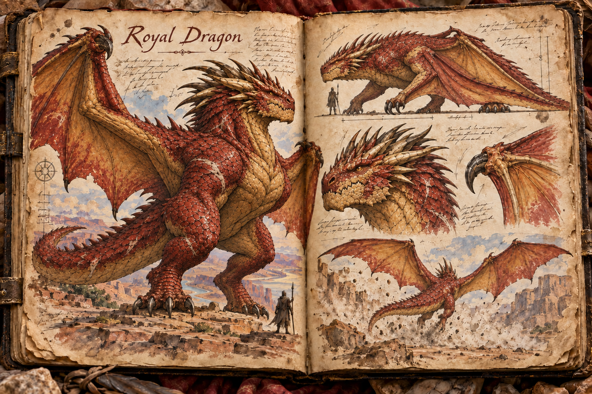
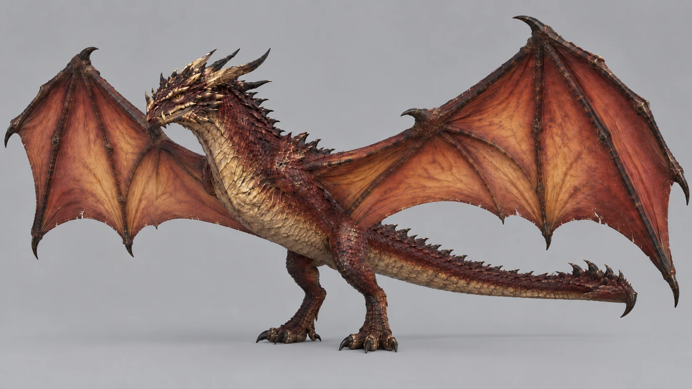

# Royal Dragon

The Royal Dragon is a proud, highly intelligent dragon species marked by red-gold scales, crown-like horns, and a massive wyvern body plan. It has two thick hind legs and two broad wings whose arm bones serve as its forelimbs; on the ground it walks on its hind feet and the knuckled wrists of its folded wings, and it never has a separate pair of front legs. It measures about 15 metres from nose to tail, spans about 35 metres across the open wings, and weighs several tonnes; even prowling with its head carried low, it looks down on a rider on horseback, and the bulk behind that head makes a resting dragon feel like a fortress that has decided to watch you.

## Appearance and Visual Design

A Royal Dragon looks like old, hard-won power before it looks like anything else. It is a heavy brute of an animal: a barrel chest, slab-muscled shoulders where the wings anchor, a thick neck corded with muscle, and a broad skull with a deep, crushing jaw. Its scales run from deep crimson across the back, neck, tail, and legs to a dull, warm gold along the throat, chest, belly, and wing bones. They are thick, rough, overlapping plates rather than fine enamel, polished only where canyon wind and stone have worn them smooth. The crown-like horns are not a single ornament but a branching crest of thick, swept-back spines, ivory at the base and darkening toward the tips, with gold-coloured ridges along the jaw and brow that make the head read like a battered war-helm. The royalty is in that crown, in the colouring, and in the unhurried calm of a creature that has never had to run from anything.

The body plan is a wyvern's, with four limbs in total: two hind legs under the hips and two wings growing from the shoulders, with no independent forelegs at all. On the ground the Royal Dragon carries its body low and nearly horizontal, head thrust forward, and moves like a great bat or pterosaur, taking its weight on its hind feet and on the hooked claws at the wrists of its folded wings. Folded, the wing membranes wrap its flanks like a heavy cloak, and the long, thick tail drags and sweeps behind it, gouging the dust. To take off, it rears back onto its hind legs and drives the wings down in a blast of grit. Concept art may show this grounded, four-point stance, but it must read unmistakably as folded wings rather than front legs: the membrane visible along each forelimb, a wrist claw where a foot would be, and nothing growing from the chest. Wing membranes are warm amber near the bones and darken to deep crimson toward the edges, showing veins of heat and mana when backlit by the sun.

Old dragons wear their history openly: chipped and cracked scales, pale scars where challengers once landed a blow, smoke-darkened horn tips, and fine mesa dust caught between the claws. The royal impression comes from the creature itself rather than props, so concept art keeps it on mesa stone or open sky, with no coins, gold objects, treasure piles, or hoard imagery around it. The eyes are the most important detail, amber, bright, assessing, and uncomfortably intelligent. The contrast between that brutish frame and those eyes is the point of the design, so a player feels judged by the mind before they are threatened by the body.

## Behaviour

Royal Dragons do not attack every creature that approaches them. They prefer to fight enemies they consider worthy and may ignore weak attackers entirely. If harassed, a Royal Dragon might swat, tail-whip, or drive the offender away rather than commit to a full battle. This makes the encounter feel judgemental and ceremonial instead of purely aggressive.

Royal Dragons are often found alone or with a lifelong partner. A bonded pair is a major regional threat, because harming one can draw the full attention of the other.

## Gameplay Role

The Royal Dragon is a high-prestige encounter tied to reputation, territory, flight, and player restraint. Players are sent to observe it, steal from its lair, negotiate passage through its domain, or prove themselves before it accepts combat. Defeating one is rare and consequential, while earning its tolerance can become a story in itself. If a Royal Dragon ever becomes a flying mount, that bond belongs at the far edge of [Taming and Control](../Taming-and-control.md): it is closer to an alliance with a dangerous intelligence than ownership of an animal.

## Story Hook

A mesa settlement survives by leaving tribute at the edge of a dragon's hunting ground, not because the dragon demands worship, but because generations of restraint have taught both sides where the boundary lies. When a young raiding guild steals from the offering cairn and wounds the dragon's mate during its escape, the whole region waits to see whether the players can return what was taken, punish the insult, or face the judgement of a creature that remembers exactly who crossed into its domain.

See also: [Creatures index](../Creatures.md), the [Mesa](../Biomes/Mesa.md) where it nests, [Reputation System](../Reputation-system.md), and [Travel and Mounts](../Travel-and-mounts.md) for its place among flying mounts.

## Concept Drawing

## Draft

<!-- Raw notes land here. Add new content in any form; an AI assistant reworks it into the body above as finished prose, then clears what it has integrated. -->
