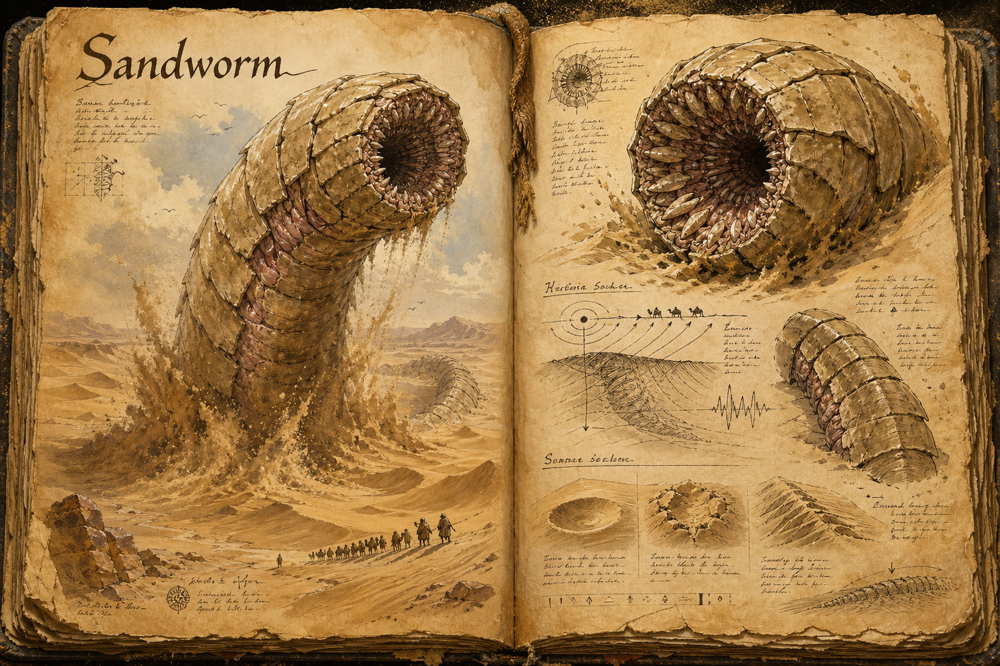

# Sandworm

The sandworm is a colossal burrowing predator of the deep desert, a creature so large that the dunes themselves seem to move when it travels beneath them. It spends almost its whole life below the surface, surfacing only to feed, and for most travellers the first and last sign of one is the sand beginning to pour inward toward a hollow that was not there a moment ago. It is the apex hazard of the [Scorching Desert](../Biomes/Scorching-desert.md), the reason the open dunes are feared even by those who have learned to survive the heat.

## Appearance and Visual Design

A sandworm is usually seen in fragments, and those fragments are enough to make the rest of it feel enormous. The visible body is a chain of overlapping armour plates the colour of sun-baked sand, each segment ridged and scarred by stone, old weapons, and the pressure of moving beneath the desert. When it breaches, the plates unfold through the dune like a moving wall, shedding sheets of sand that briefly outline a length far greater than the player can fight head-on.

The head is blunt and terrible, with no visible eyes and a circular mouth lined with grinding plates rather than neat teeth. Its skin between the armour rings is pale, raw, and rarely exposed, which makes each strike window visually readable when the shell cracks or flexes. A moving worm leaves signs before it appears: long subsurface ripples, shallow sink lines, sudden collapsing bowls, and the faint dark curve of a dorsal ridge cutting through the dune. The design makes players fear the ground as much as the creature, because most of the sandworm's body is the desert hiding its own weapon.

## Hunting by Vibration

A sandworm is effectively blind and hunts by feeling the world through the sand. Steady, rhythmic movement across open dune draws it the way blood draws a shark, and a party marching in step or a mount galloping flat-out announces itself for a long way through the ground. Survival in worm country is therefore a matter of how a player moves rather than how hard they can hit: crossing on bare rock where the creature cannot follow, breaking stride into an irregular, arrhythmic gait, holding still when the sand begins to shiver, and keeping off the deep open dunes entirely when there is any other route. A worm that strikes erupts from below to swallow whatever stands above it, so the danger is not a fight to be won but an ambush to be denied.

## Role and Rewards

Killing a sandworm is the work of a prepared group and rarely worth attempting for its own sake, but a dead worm is a windfall: its hide, segmented plating, and the dense matter of its body yield rare crafting materials suited to desert gear and high-tier work, the kind of haul that justifies an expedition mounted specifically to bait and kill one. More often the worm is something to be routed around, which makes knowledge of its territory and habits a tradeable commodity in the frontier settlements at the desert's edge.

## Story Hook

A prospector's outpost on the desert margin posts a standing bounty, not for a worm's death but for the safe return of a caravan it took, swallowed whole with a season's water and trade goods aboard. The wreckage, if it can be reached, lies somewhere in the worm's wake, and the only way to find it is to learn the creature's hunting circuit well enough to walk it without becoming the next thing the sand pours in toward.

See also: [Creatures index](../Creatures.md) and the [Scorching Desert](../Biomes/Scorching-desert.md) it rules.

## Concept Drawing

## Draft

<!-- Raw notes land here. Add new content in any form; an AI assistant reworks it into the body above as finished prose, then clears what it has integrated. -->
