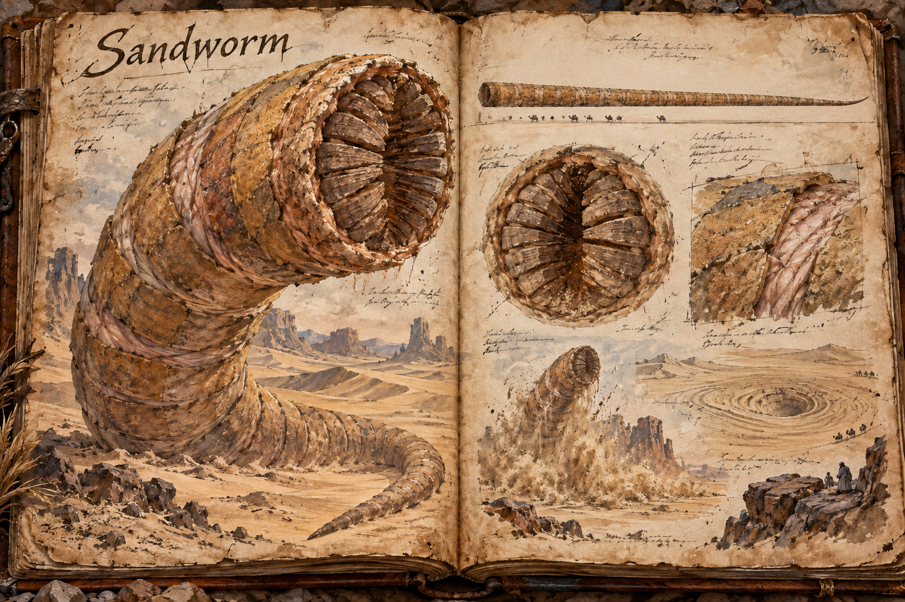
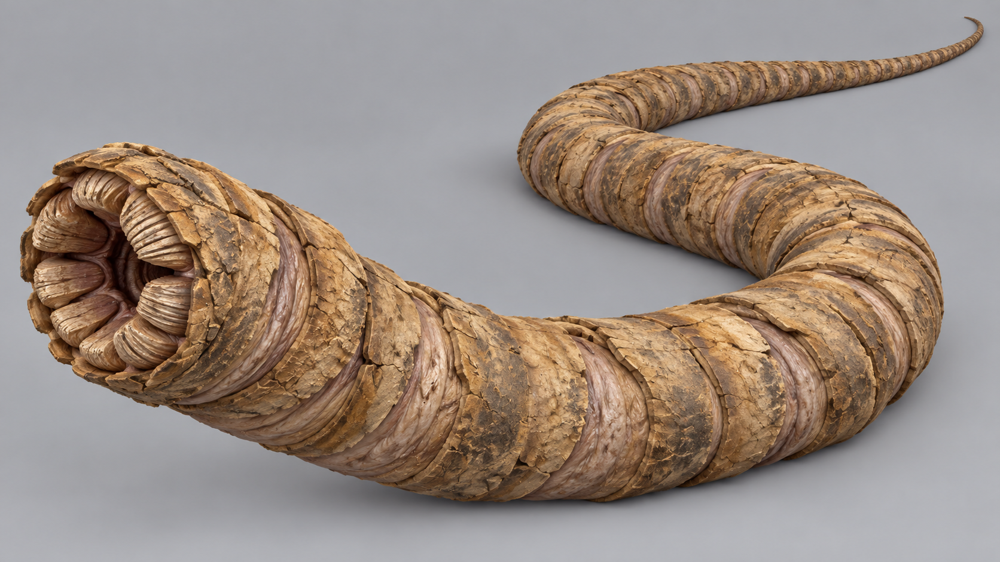

# Sandworm

The sandworm is a colossal burrowing predator of the deep desert: a limbless, segmented tube about 150 metres long and 12 metres across, with a mouth 10 metres wide that can swallow a wagon or a small caravan whole. It spends almost its whole life below the surface, so large that the dunes seem to move when it travels beneath them, and for most travellers the first and last sign of one is the sand beginning to pour inward toward a hollow that was not there a moment ago. It is the apex hazard of the [Scorching Desert](../Biomes/Scorching-desert.md), and only one lives in each desert region.

## Appearance and Visual Design

A sandworm is usually seen in fragments, and those fragments are enough to make the rest of it feel enormous. The body is a chain of overlapping armour plates the colour of sun-baked sand, each segment ridged and scarred by stone, old weapons, and the pressure of moving beneath the desert, and it tapers along its length to a narrow tail. It has no limbs. When it breaches, the forward part of the body rears out of the dune and the plates unfold like a moving wall, shedding sheets of sand that briefly outline a length far greater than a player can fight head-on.

The head is blunt and has no eyes. Its circular mouth is lined with grinding plates rather than teeth, broad ridged surfaces that crush what they close on. Between the armour rings the skin is pale, raw, and rarely exposed, which makes each strike window readable when the shell cracks or flexes. A moving worm leaves signs before it appears: long subsurface ripples, shallow sink lines, and the faint dark curve of a dorsal ridge cutting through the dune.

## Hunting by Vibration

A sandworm is blind and hunts by feeling the world through the sand. Steady, rhythmic movement across open dune draws it the way blood draws a shark, and a party marching in step or a mount galloping flat-out announces itself for a long way through the ground. The attack follows a fixed order that a watchful player can read. First comes a low rumble through the ground, then the sand begins to pour into a bowl that sinks under the victim's feet, and then the worm breaches from below and swallows whatever stands above it. A swallowed player, mount, or wagon does not survive, but its cargo stays inside the worm and can be recovered when the worm is killed.

Survival in worm country is therefore a matter of how a player moves rather than how hard they can hit. The best answer is to cross on the bare rock outcrops that rise out of the desert, where the worm cannot follow, and to break stride into an irregular gait when the sand begins to shiver. A worm can also be drawn away with bait: a thumper driven into the sand and left beating sends out a rhythm of its own, and the worm goes to it instead of to the caravan. When a worm is surfaced, its pale skin between the plates is the only place a weapon does real harm, which is why prepared groups strike from the flanks as it rears. A badly hurt worm burrows away to heal, and it returns to the same hunting grounds after a long time.

## Role and Rewards

Killing a sandworm is the work of a prepared group and rarely worth attempting for its own sake, but a dead worm is a windfall. Its armour plates give material for desert and heat-resistant gear, its grinding plates are prized for heavy tools and weapons, and the dense matter of its body is a rare high-tier crafting resource. The kill also returns anything the worm has swallowed. Because a region has a single worm and a dead one is slow to be replaced, knowledge of its territory and habits is a tradeable commodity in the frontier settlements at the desert's edge.

## Story Hook

A prospector's outpost on the desert margin posts a standing bounty, not for a worm's death but for the cargo of a caravan it took, swallowed whole with a season's water and trade goods aboard. The goods are still inside, and the only way to recover them is to learn the creature's hunting circuit well enough to bait it onto open sand, hurt it until it breaches, and carry the contents out of a thing the size of a canyon.

See also: [Creatures index](../Creatures.md) and the [Scorching Desert](../Biomes/Scorching-desert.md) it rules.

## Concept Drawing

## Inspiration

The sandworm takes its cue from the sandworms of Frank Herbert's Dune ([Sandworm](https://dune.fandom.com/wiki/Sandworm)): colossal desert creatures that hunt by the rhythm of movement on the sand and swallow caravans whole. Here the worm is smaller, about 150 metres, there is one to each desert region rather than a whole planet's worth, and a prepared group can kill it.

## Draft

<!-- Raw notes land here. Add new content in any form; an AI assistant reworks it into the body above as finished prose, then clears what it has integrated. -->
