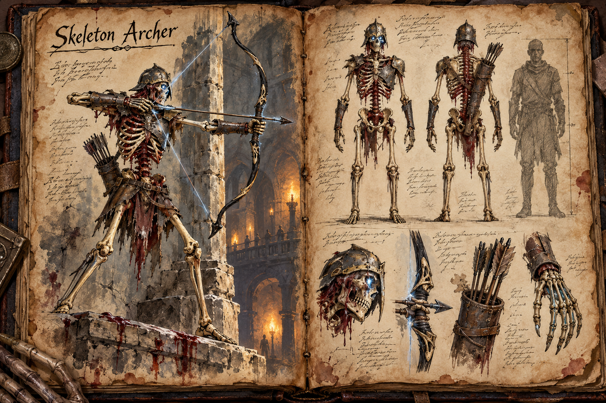
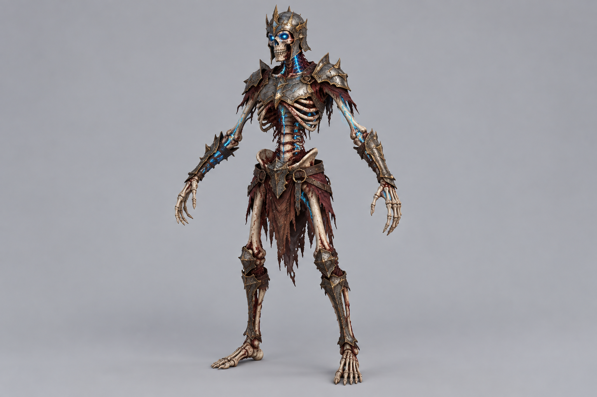

# Skeleton Archer

Skeleton Archers are the ranged half of the undead garrison that holds the world's [Dungeons](../Structures/Dungeons.md). Like the [Skeleton Knight](Skeleton-Knight.md) they stand beside, they are sustained by the dungeon itself and bound to it, which is why they exist only in the dark and only inside their own walls; the rule that ends them at the dungeon's edge is set out in [Dungeons](../Structures/Dungeons.md). They exist to make the dark harder to move through.

## Appearance and Visual Design

A skeleton archer stands 1,80 metres tall, the same height as a knight but slighter in build, a biped on two legs with exposed ribs, long finger bones and shoulders pulled back into the tense posture of something eternally drawing a bow. The armour is partial and practical: a cracked helm, a small breastplate, forearm guards and scraps of leather that do not protect so much as preserve the silhouette of a former soldier. Cold blue dungeon-magic threads through the spine and the bow arm, and two points of the same light burn in the eye sockets. With so little armour, the blood its still-living marrow seeps, for the reason [Dungeons](../Structures/Dungeons.md) gives, is on full display: the exposed ribs, spine, pelvis and skull glisten dark red and half-congealed, the blood beading at the joints and dripping from the ribcage, while the long finger bones and shins stay pale. An archer that holds a ledge for long stains the stone beneath it, which marks its post before the archer itself is seen.

The bow is a recurve of bone laminations over blackened wood, and its string is a line of that blue light, which brightens as the archer draws. Its arrows are brittle-looking shafts tipped with rusted iron, drawn from a quiver that never visibly empties while the archer stays inside its bound space. In darkness the archer is first seen as two cold points above a rail or ledge, then as a thin outline revealed by the movement of the draw. Once reached it looks fragile and wrong, all angles and hollow spaces, built to be terrifying at range and breakable up close.

## Behaviour and Encounter

A skeleton archer is a positioning threat rather than a brawler. It takes high ground, ledges and the far ends of long halls, and it punishes players who fixate on the enemy in front of them while ignoring the line of fire from above. A single archer looses visible, single heavy arrows that a watchful player can see coming and sidestep; a group looses volleys that cover a whole corridor and soften a party before the knights close. The string glows brighter while the archer draws, and that brightening is the tell to break line of sight.

The archer holds its ledge until someone approaches, then moves to another, and in melee it backs away to regain distance rather than trading blows. The answers are the ones a dungeon fight is built around: break the line of sight behind pillars and corners, close the distance so it has to retreat, collapse or shoot out the ledge it stands on, or take the archers down first and accept the punishment on the way in. Left untouched while a party deals with the knights, a handful of archers can decide an encounter from across the room. A dead archer leaves arrows, bow parts and bone.

## Story Hook

Deep in one dungeon, a gallery of archers stands ranked along a balcony above a hall with no visible stair, loosing at anything that enters and never running short of arrows. The way up is the puzzle, and the players who solve it find that the archers were guarding the route rather than the room, and that whatever lies beyond the balcony was worth posting a wall of the dead to keep the living from reaching.

See also: [Creatures index](../Creatures.md), the [Skeleton Knight](Skeleton-Knight.md) that fights beside it, and the [Dungeons](../Structures/Dungeons.md) that bind them.

## Concept Drawing

## Draft

<!-- Raw notes land here. Add new content in any form; an AI assistant reworks it into the body above as finished prose, then clears what it has integrated. -->
