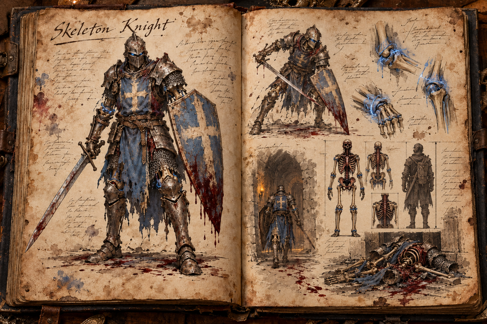

# Skeleton Knight

Skeleton Knights are the armoured front line of the undead that hold the world's [Dungeons](../Structures/Dungeons.md). They are not wandering monsters but fixtures of the places that made them: the dungeon itself animates and sustains them, so they are only ever met inside one. There is one kind of knight, a mindless wall that presses steadily forward and gives way only when it is broken or forced out.

## Appearance and Visual Design

A skeleton knight stands 1,80 metres tall, upright and broad-shouldered in its armour, and walks with a slow, deliberate tread on two legs, carrying a longsword in one hand and a kite shield in the other. It looks less like a corpse that found armour and more like a dungeon's memory of a soldier. Its bones are yellowed and incomplete, held together by thin cords of cold blue dungeon-magic rather than muscle, and those cords flare brighter at the joints when it braces or swings. The bones are never dry: their marrow still makes blood, as [Dungeons](../Structures/Dungeons.md) explains, and a thick, dark, half-congealed layer of it coats the ribcage, spine, pelvis and skull, runs down under the plate, oozes from the gaps between armour pieces and drips from the shield's lower edge, while the long bones of the arms and legs stay drier and paler. A knight that has held the same hall for long leaves a dark, smeared track along its patrol line. The armour is heavy plate over chain and leather, pitted, rusted and scratched by earlier delves, but still arranged with military purpose: shield forward, helm low, sword held close until the moment it strikes.

Every knight wears the same insignia, a faded blue tabard under the breastplate and a pale cross on the face of the kite shield, so a hall of them reads at once as one garrison. Beyond that the kit varies with the place: some have scraps of tabard fused under corroded breastplates, others wear mismatched armour the dungeon has gathered from fallen adventurers, and older knights have stone dust, candle wax or root fibres worked into their mail. The face is a skull behind a visor with only a faint blue light in the sockets, deliberately unreadable.

## Behaviour and Encounter

A skeleton knight fights as a disciplined melee bulwark, the anchor a dungeon's defence is built around. It holds chokepoints and advances without fear, fatigue or pain, pushing a party back step by step rather than chasing individuals through a room. In the tight corridors and guarded vaults of a dungeon, paired with [Skeleton Archers](Skeleton-Archer.md) behind it, it becomes the wall that pins a party in place while other things close in.

Its attacks are sword combinations, a shield bash that staggers whoever it lands on, and a guard stance in which it plants the shield and blocks everything that comes from the front. It lowers the shield just before a swing, and that lowering is the tell: the moment to step aside or strike before the blade arrives. Blunt weapons crack bone and armour together, so hammers and maces do what edged weapons struggle to, and heavy blows break the guard. Flanking works because the knight turns slowly, and a player who circles behind the shield meets far less resistance than one who stands in front of it.

It also has a weakness no other enemy shares: a knight forced across the dungeon's threshold collapses, which turns a doorway into a weapon ([Dungeons](../Structures/Dungeons.md) sets out the rule). A dead knight leaves rusted arms, armour scraps, bone and fragments of dungeon-magic.

## Story Hook

At the mouth of a cave dungeon, the old hands of a nearby settlement tell newcomers never to fight the knights in the gallery. The knights do not chase and do not stop. They advance one measured step at a time, shield forward, and push whoever stands in front of them back along the passage. Parties that try to hold the line in the gallery are ground down, since the wall never tires and never breaks formation. The ones that survive learn the trick instead: give ground all the way back to the cave mouth and let the edge of the dungeon finish the fight.

See also: [Creatures index](../Creatures.md), the [Skeleton Archer](Skeleton-Archer.md) that fights beside it, and the [Dungeons](../Structures/Dungeons.md) that bind them.

## Concept Drawing

## Draft

<!-- Raw notes land here. Add new content in any form; an AI assistant reworks it into the body above as finished prose, then clears what it has integrated. -->
