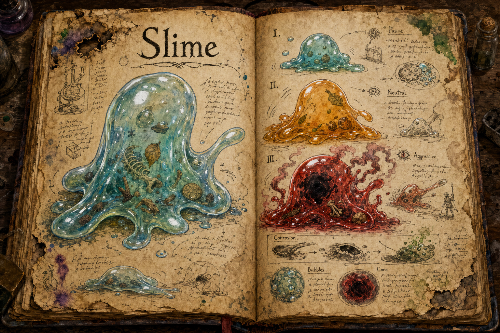

# Slime

Slimes are among the world's strangest and most adaptive creatures, gelatinous bodies that grow, evolve, and reshape themselves in response to what they eat and where they live. A slime is rarely a fixed threat; it is a threat in progress, harmless today and potentially catastrophic if left to feed. They share a set of traits across every form, and those shared traits are what make a slime dangerous in ways a fixed-stat monster never is.

## Appearance and Visual Design

A slime is a creature of volume, colour, and motion rather than anatomy. Its body has no bones, face, or fixed outline, only a shifting mass of gel that swells, folds, and pulls itself forward in slow elastic surges. Small slimes are clear enough to see stones, leaves, bones, and half-digested scraps suspended inside them, while older ones become cloudier as absorbed matter thickens the body. Their edges never sit completely still; even an idle slime trembles, puckers, and searches the ground with small pseudopods.

Colour is the player's fastest read on temperament and risk. Passive slimes remain cool and translucent, catching blue and green light like pond water. Neutral slimes turn warmer and denser, with amber layers and slow bubbles that make them feel heavy rather than harmless. Aggressive slimes become opaque red masses with darker cores, pulsing from within as corrosion fumes haze the air around them. Environment and diet can tint those baselines, so a swamp-fed slime may carry black mud and reed fragments, while one raised on metal scrap might glitter with dangerous inclusions.

## Shared Traits

Every slime can grow and evolve over time, fuelled by the food and corpses it consumes. Feeding on the corpses of other slimes accelerates this growth dramatically, but it also pushes the creature toward a more aggressive form, so the fastest path to a larger slime is also the path to a more dangerous one. Slimes attack by engulfing their target and dealing corrosive damage over time, and that corrosion eats at armour and carried equipment as readily as at flesh, making an unchecked slime a threat to a player's gear as much as their health, with the consequences for ruined kit reaching into [Inventory](../Inventory.md). Their malleable bodies shrug off small or piercing attacks, so blades and arrows accomplish little; large blunt weapons and powerful magic, including the area spells covered in [Magic](../Magic.md), are the reliable answers. No slime can be tamed, but a player who controls a slime's environment and diet can steer its growth and evolution deliberately, which makes them less a creature to be hunted than a force to be cultivated, and a risky one.

## Passive Slime

Passive Slimes are the weakest and least threatening of the family. They actively avoid danger, fleeing from threats rather than fighting, and will go out of their way not to attack a player, creature, or anything else. Despite that meekness they still grow and evolve, and a passive slime's path forks toward either a Neutral or an Aggressive form depending on its diet and surroundings, with a diet of slime corpses giving the fastest growth at the cost of tipping it toward aggression. They are small and translucent, usually blue or green, and easy to mistake for harmless ambience right up until one has been fed into something else.

## Neutral Slime

Neutral Slimes are defensive by nature and attack only when provoked, but a provoked one is a serious problem: its engulfing attack deals corrosive damage over time that severely weakens armour and equipment, so even a fight a player wins can cost them their gear. They retaliate readily once struck, which makes them dangerous to approach unprepared, and they can evolve only in one direction, toward the Aggressive form, as diet and environment push them. A neutral slime is markedly larger than a passive one, often the size of a cow, and its colour shifts to warm tones of orange and yellow that mark it out at a distance.

## Aggressive Slime

Aggressive Slimes are the most dangerous form, attacking anything in sight without provocation and growing without limit as long as they can find food. This makes them a threat that compounds: a small aggressive slime is a manageable fight, but one left to feed grows into a catastrophe, and a fully grown specimen can overwhelm even the most powerful creatures in the world, dragons included. They carry the family's resistance to small weapons and projectiles, so the only dependable counters are heavy blunt force and large area-of-effect magic, ideally before the creature has had time to grow. Their colour deepens to red and their bodies turn dense and opaque as they swell, until a mature one is a pulsing mass that is a terrifying sight on any battlefield. A player cannot tame such a thing, but with careful planning and considerable risk they can raise and guide a slime toward this form deliberately, turning it into an indirect weapon aimed at someone else's walls.

## Story Hook

A frontier outpost once kept a passive slime in a pit to dispose of refuse and the occasional corpse, a tidy arrangement until someone discovered how much faster it grew on the dead and began feeding it in secret. By the time the colour turned, it was too large for the pit and too aggressive to approach, and the outpost found it had bred its own siege engine. The questions left behind, who fed it, whether it can still be steered, and toward whose gate, are exactly the kind of trouble a cultivated slime leaves in its wake.

See also: [Creatures index](../Creatures.md), the [Forest](../Biomes/Forest.md) and [Plains](../Biomes/Plains.md) it drifts through, [Magic](../Magic.md), and [Inventory](../Inventory.md).

## Concept Drawing

## Draft

<!-- Raw notes land here. Add new content in any form; an AI assistant reworks it into the body above as finished prose, then clears what it has integrated. -->
