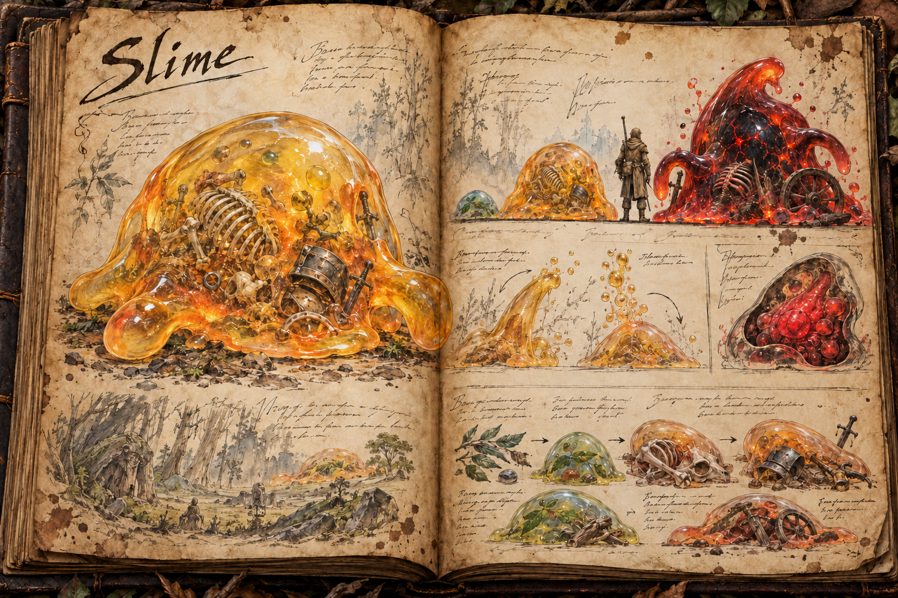
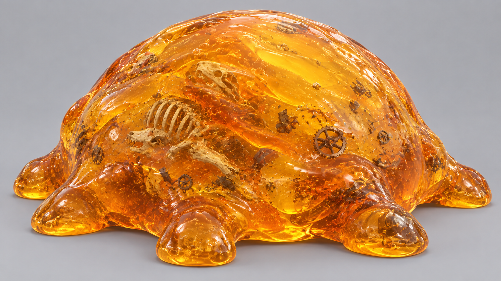
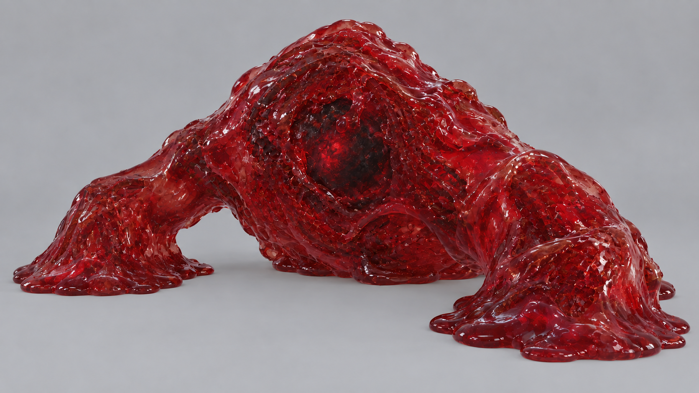

# Slime

Slimes are gelatinous creatures that grow and change form according to what they eat, and that is what makes them unlike any other family in the bestiary. A slime is rarely a fixed threat; it is a threat in progress, a harmless blob on the plains today and a corrosive siege-scale mass within days if the wrong things are fed to it. The family splits into three forms, the [Passive Slime](Passive-slime.md), the [Neutral Slime](Neutral-slime.md), and the [Aggressive Slime](Aggressive-slime.md), and each has its own file for size, appearance, and encounter. This hub holds what all three share.

## Biology and Appearance

A slime has no bones, no face, no limbs, and no fixed outline: it is a single mass of gel that pulls itself across the ground in slow elastic surges and reaches out with pseudopods, temporary arms of gel that form, grip, and dissolve back into the body. Even an idle slime trembles and puckers at its edges as it searches the ground. The gel is clear when young, so stones, leaves, bones, and half-digested scraps hang visible inside it, and it clouds as absorbed matter thickens the body.

Colour is the player's fastest read on temperament. Passive slimes are cool and translucent, catching blue and green light like pond water; neutral slimes turn warmer and denser, with amber layers and slow bubbles; aggressive slimes are opaque red masses around a darker core. What a slime has been eating tints those baselines, so one raised in a swamp carries black mud and reed fragments, and one raised on scrap metal glitters with dangerous inclusions.

## Diet and Form

A slime's diet decides its form. A slime that eats only plants stays passive. One that feeds on meat and corpses turns neutral, and one that eats metals or the corpses of large creatures becomes aggressive. The change is not instant: a slime needs days of steady feeding to shift from one form to the next, and the colour change described above is the visible sign that it is under way. The corpses of other slimes accelerate growth dramatically but push the creature toward the aggressive form, so the fastest route to a large slime is also the most dangerous one. A passive slime can fork toward either neutral or aggressive depending on its feed, while a neutral slime can only go on to become aggressive; nothing sets a hardened slime back.

## Attacks and Counters

Every slime attacks by engulfing its target, and the corrosion that follows eats armour and carried equipment as readily as flesh, so an unchecked slime threatens a player's kit as much as their health, with the consequences for ruined gear reaching into [Inventory](../Inventory.md). The malleable body shrugs off small and piercing attacks, which makes blades and arrows close to useless; large blunt weapons, fire, salt reagents, and powerful area magic from [Magic](../Magic.md) are the dependable answers. A slime leaves gel when it dies, a base material for alchemy and crafting, and the heavier forms add what their diet put into them, covered in each tier file.

## Taming and Steering

No slime can be tamed, and none will accept a saddle or a bond of any kind from [Taming and Control](../Taming-and-control.md). What a player can do is steer it. A slime follows the scent of food, so a player who controls what it eats controls what it becomes, and a slime that has turned aggressive can be led by bait toward a chosen place. That makes a slime less a creature to hunt than a force to cultivate, and a risky one: the same tools that aim it at a rival's walls work just as well for a rival aiming it at yours.

## Habitat

Slimes are found wherever soft ground and plentiful scraps let them feed unnoticed, which in practice means the open [Plains](../Biomes/Plains.md), where passive slimes creep through the grass, and the hollows of the [Forest](../Biomes/Forest.md), where carrion turns them neutral. Wild aggressive slimes are rare; most exist because someone fed them.

## Story Hook

A frontier outpost once kept a passive slime in a pit to dispose of refuse and the occasional corpse, a tidy arrangement until someone discovered how much faster it grew on the dead and began feeding it in secret. By the time the colour turned, it was too large for the pit and too aggressive to approach, and the outpost found it had bred its own siege engine. Who fed it, whether it can still be steered, and toward whose gate are the questions the outpost now has to answer.

See also: [Creatures index](../Creatures.md), [Passive Slime](Passive-slime.md), [Neutral Slime](Neutral-slime.md), [Aggressive Slime](Aggressive-slime.md), the [Forest](../Biomes/Forest.md) and [Plains](../Biomes/Plains.md) it drifts through, [Magic](../Magic.md), and [Inventory](../Inventory.md).

## Concept Drawing

## Draft

<!-- Raw notes land here. Add new content in any form; an AI assistant reworks it into the body above as finished prose, then clears what it has integrated. -->
