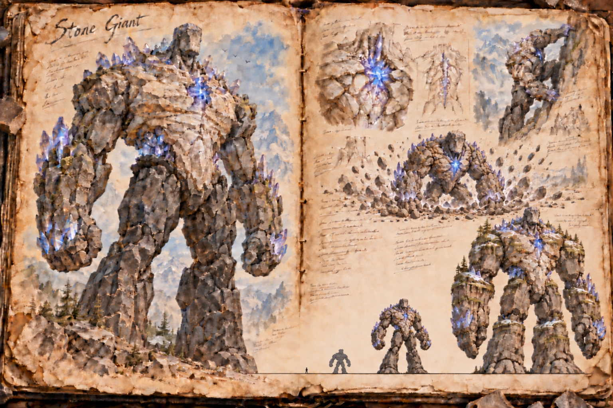
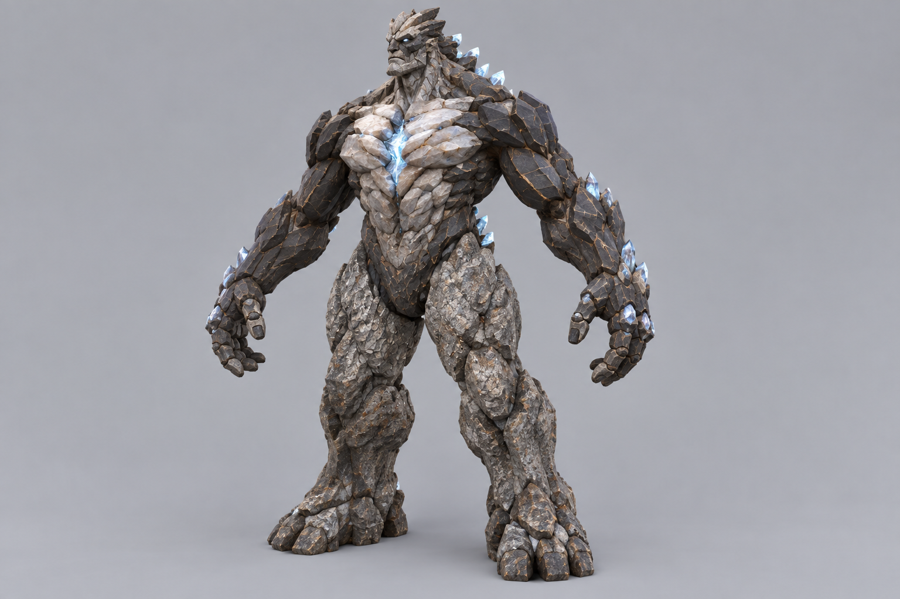
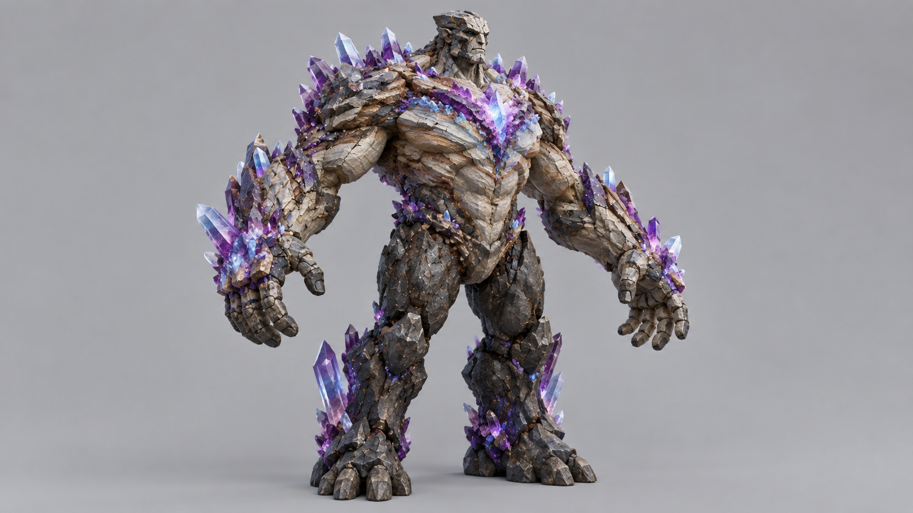
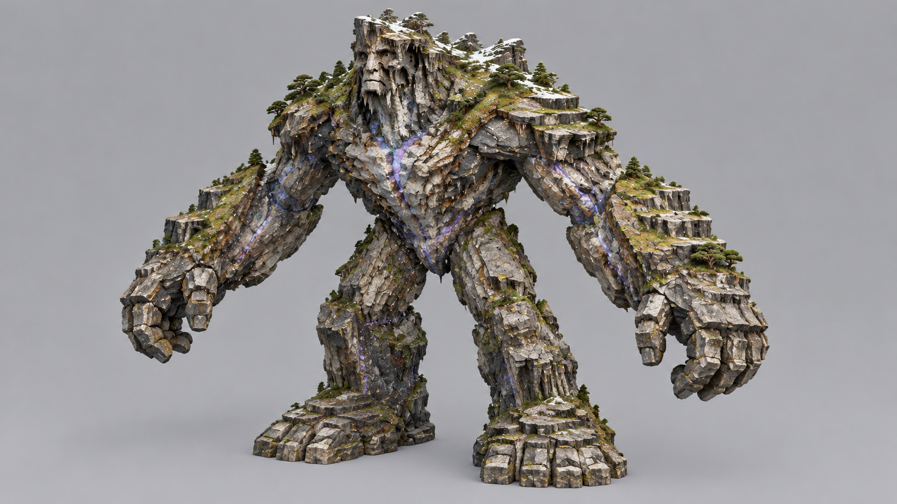

# Stone Giant

Stone Giants are colossal beings of living stone, animated by the mana they draw from the crystals buried in the mountains. They come in three tiers that grow with age: the [Young Stone Giant](Young-stone-giant.md), about the height of a house, the [Adult Stone Giant](Adult-stone-giant.md), as tall as a tower, and the [Elder Stone Giant](Elder-stone-giant.md), a walking mountain. They are among the elder beasts that [Setting and Lore](../Setting-and-lore.md) counts as pieces of the world's own myth, and they roam the high country of the [Mountain Range](../Biomes/Mountain-range.md) in a perpetual search for the crystals that keep them alive. Most of the time they are peaceful, and the danger is what happens when a player stands between a giant and its crystals.

## Living Stone and Mana

Mana is a giant's lifeblood. Fully charged, it regenerates, sealing the cracks and fractures in its stony flesh; starved, it slowly crumbles, and if its reserves run out entirely it collapses into a heap of mineral-rich rubble that daring scavengers prize. Its body is built from overlapping strata of granite, basalt, shale and quartz, and mana crystals grow in seams along the spine, shoulders, knuckles and chest, glowing blue-white or violet from within the rock when the giant is healthy. The crystals are the only strong colour in the design, and a starving giant loses that light first: the crystals dull, the cracks widen, gravel sloughs from its joints, and dry dust pours from its wounds the way blood would from flesh. A giant's heart is a dense core of crystal set inside the body, and it is the one part that cannot be mended once it is struck.

A giant's size is a measure of its age and its appetite. The larger and older it grows, the more crystals it needs to sustain itself, which sets giants against one another: fights for mana erupt between them, and the victor absorbs what remains of the loser to extend its own life. Their fights flatten ridges and bury passes, and the settlements that live in the shadow of one know to keep well clear of the quarrel.

## What Provokes a Giant

A giant roaming undisturbed ignores players and walks on. It turns hostile in three cases: when its crystals are threatened, when something climbs it, and when it is hungry and meets a player carrying crystals. The third is the trap for miners, since the same mana crystals they haul out of the mountain are what a hungry giant smells from far away. A giant in that state comes straight for the carrier.

The attacks a hostile giant uses are the same at every tier, scaled to its size: a stomp that crushes whatever is beneath the foot, a sweep of the arm that clears a ledge, boulders torn from its own body and hurled, and a shockwave struck into the ground that throws everything nearby off its feet. The tell is grinding stone and crystals that flare bright in the seams, which gives anyone within sight a moment to run or take cover before the blow lands. The tier files describe which of these dominates at each size.

## Feeding a Giant

A giant that has been fed enough crystals is pacified for a while, and a pacified giant tolerates work near it. Crystals are handed over or laid out in its path, and what counts as enough depends on its hunger, which rises with its size. A well-fed giant stops hunting crystals, ignores players who carry them, and lets miners dig in its range without trouble until its mana falls and the hunger returns. This is how mining settlements live beside one, and it is always a costly arrangement: the tribute is crystal the settlement could have sold, it has to be paid again and again, and a settlement that misses a payment wakes up to a giant at its gates. The feeding ties directly to the mana hunger that drives the creature, and the tier files describe what it costs at each size.

## Killing a Giant

A stone giant cannot be fought like a living thing, and a sword accomplishes little against it. There are three ways to bring one down, and each leaves a different reward. The first is the miner's: climb the body, chip through the shell with a sturdy pickaxe to expose the crystalline heart, and strike it, which yields the heart core, the rarest piece of the giant. The second is starvation: mine out the crystal veins within the giant's range and leave it nothing to feed on, and it weakens and crumbles over time, leaving its crystals in the hands of whoever emptied the mountain. The third is siege: cannons and catapults can wear a giant down from a distance, but the reward is only ore rubble, since the giant falls apart without a clean kill of the heart. Climbing is hard because the giant does everything in its power to throw climbers off, crushing makeshift platforms and swatting away players on the body; how hard depends on the tier.

## Story Hook

A mining settlement in the high passes has prospered for years by quietly feeding crystals to an old stone giant that wanders nearby, keeping it docile and far from their tunnels. Now a larger giant has entered the region, the two have begun to fight over the crystal seams the settlement depends on, and the miners face a choice: pick a side in a war between mountains, find a way to drive both giants off, or abandon a hold that may not survive the next clash.

See also: [Creatures index](../Creatures.md), the [Mountain Range](../Biomes/Mountain-range.md) it roams, the [Building System](../Building-system.md) for the platforms raised to scale it, and the three tiers: [Young Stone Giant](Young-stone-giant.md), [Adult Stone Giant](Adult-stone-giant.md) and [Elder Stone Giant](Elder-stone-giant.md).

## Concept Drawing

## Draft

<!-- Raw notes land here. Add new content in any form; an AI assistant reworks it into the body above as finished prose, then clears what it has integrated. -->
