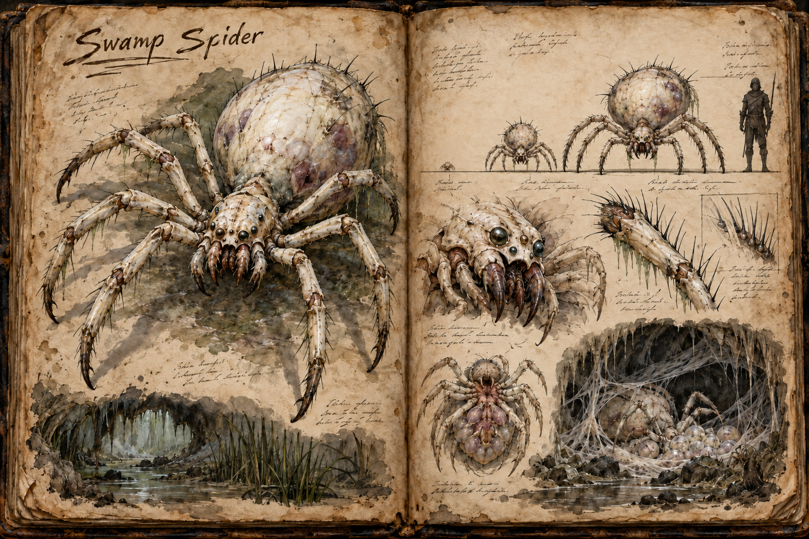

# Swamp Spider

The Swamp Spider is a pale cave predator whose danger lies in population rather than stealth or individual strength. Its colonies breed beneath the [Swamp](../Biomes/Swamp.md), devouring anything they can see and multiplying until the cave can no longer contain them. A settled nest holds fifty to two hundred young and two to five adults; when it outgrows its cave, the spiders pour into the wetlands in a living flood, turning an overlooked nest into a threat to every creature, traveller, and settlement nearby. Where the [Bamboo Spider](Bamboo-spider.md) is a single hunter that wins in one moment of inattention, the Swamp Spider is a swarm that wins by attrition.

## Appearance and Life Stages

Every Swamp Spider has eight legs, all attached to the forepart of a two-part body: a small cephalothorax carrying the eyes, mouthparts, and legs, and a swollen abdomen behind it. The legs are long, segmented, and tipped with a small dark claw that grips stone, wood, and wet cave ceiling alike, so the spiders crawl as easily across walls and roofs as across the floor.

Hatchlings are about 0,15 metres across, no bigger than a hand. Juveniles stand about 1 metre tall at the top of the abdomen and span about 2 metres with their legs spread. Their thin, bone-white shells and nearly colourless legs make them stark against dark mud but difficult to distinguish from pale cave growths when they crowd together underground. Sparse black sensory hairs break the smooth pallor of their bodies, each bristle long enough to bend and tremble in the cave air. They move in restless layers across floors, walls, and ceilings, so a nursery chamber seems to ripple before the player can identify any one body.

A mature spider stands about 1,8 metres tall at the abdomen, spans about 4 metres across its legs, and weighs around 150 kilograms. Its abdomen is swollen, its limbs long and ivory, and its chalk-pale carapace is scarred by bites from its own kind. Its sparse hairs are not a coat but irregular, wet-looking needles along the joints, back, and mouthparts. They quiver before the spider moves, sensing breath and vibration, so prey may see the hairs turn toward them one by one while the body remains still. The underside is thin enough to show bruised shadows of organs and eggs beneath the shell. A cluster of mismatched glassy eyes sits above pale mouthplates that hinge apart around a dark, constantly working centre, giving the face a disturbingly unfinished appearance.

Adults are far less common than juveniles. Mature females shelter fresh hatchlings in the folds beneath the abdomen, and a threatened female spills a crawling sheet of young around her own feet. Each generation begins with clutches of hundreds of eggs, but starvation, predation, trampling, disease, and cannibalism kill most of the young before they reach full size. The few that survive become the durable centre of an infestation and produce the next wave.

## The Brood Cycle

A colony is always growing toward crisis. Fresh nests hold egg mats and scattered hatchlings deep inside a cave, bound together by sheets of pale web. The web exists only inside the nest: the spiders spin no traps in the open swamp and string nothing between trees. As numbers rise, juveniles consume the cave's insects, vermin, and larger residents, then begin hunting around the entrance. Shed shells, stripped carcasses, and the sudden absence of ordinary swamp life warn that the brood is close to saturation.

Once prey can no longer support the colony, hunger turns the spiders on one another. The strongest feed on the weak, but cannibalism only delays the collapse. Eventually the surviving mass spills from the cave and spreads through the swamp, attacking anything that enters its sight. This overflow becomes a regional event: paths disappear beneath moving bodies, wildlife flees ahead of the swarm, and isolated structures face wave after wave until players break the brood or it consumes itself.

Clearing a cave suppresses the population rather than erasing the species. Destroying egg clusters and killing mature breeders buys the region a long reprieve, while ignoring a recovering nest allows the cycle to begin again. This makes each spider cave a pressure point players can scout and manage before it becomes a public emergency.

## Swarm Combat

Swamp Spiders do not fight with elaborate tactics. Juveniles rush visible prey from every available surface, climb over fallen members, and bite, and they keep closing until the target is buried under attacks. They are individually fragile, but fighting them burns stamina, ammunition, mana, and weapon durability faster than their low strength suggests. Their role is to crowd a player, obstruct retreat, and create too many immediate threats to answer cleanly.

The adults are the swarm's few durable points. An adult does not rush: it crouches on the wall or ceiling above its target and pounces, bearing the victim down and biting with a disease that carries the swamp's own illness, described in [Survival](../Survival.md). Adults survive blows that scatter the young and are tall enough to attack over them, and they steer the young, so a group that kills the adults in a nest breaks the swarm's coordination and leaves scattered, hesitant juveniles. When food is scarce, wounded and dead spiders also draw hungry members away from other prey for a moment, which a group can use to open an escape, but once the feeding frenzy ends the survivors resume the hunt.

The answer is fire, area attacks, and chokepoints. Inside an established nest, players need controlled retreat routes, overlapping area damage, and enough endurance to avoid being exhausted by hundreds of weak bodies. In the open swamp, breaking line of sight through dense terrain divides an overflow, but any spider that sees prey gives chase. The encounter reads less as defeating one monster than as holding back a tide that keeps trying to flow around the group.

## Ecological Impact

An overflowing colony briefly empties part of the swamp. Small animals vanish first, larger predators are dragged down by numbers, and carcasses left in the water draw the swarm farther from its cave. Once the available food is gone, the spiders cannibalise one another until only scattered survivors remain. Ordinary swamp life then returns, and the few mature spiders that escaped begin new nests in abandoned caves.

This cycle lets the creature change the biome without permanently stripping it. A quiet cave mouth, a marsh emptied of animal calls, or a line of pale juveniles crossing black water becomes a readable warning that the local ecology is about to break.

## Drops

Dead spiders leave chitin plates that work as light armour stock and, from the adults, pale reagents prized in alchemy. A cleared nest yields egg clusters, which alchemists buy for their potent, unstable contents.

## Story Hook

Trappers report that an entire stretch of swamp has gone silent. Their bait remains untouched, no birds call from the reeds, and the last supply boat returned with pale hatchlings clinging beneath its hull. At the nearest cave, the ground appears white until the mass turns toward the players at once. They can descend to destroy the egg chambers before the colony spills out, or retreat and face the swarm when it reaches the raised settlements downstream.

See also: [Creatures index](../Creatures.md), the [Swamp](../Biomes/Swamp.md) where its colonies grow, and [Survival](../Survival.md) for the expedition pressure of fighting deep in the wetlands.

## Concept Drawing

## Draft

<!-- Raw notes land here. Add new content in any form; an AI assistant reworks it into the body above as finished prose, then clears what it has integrated. -->
