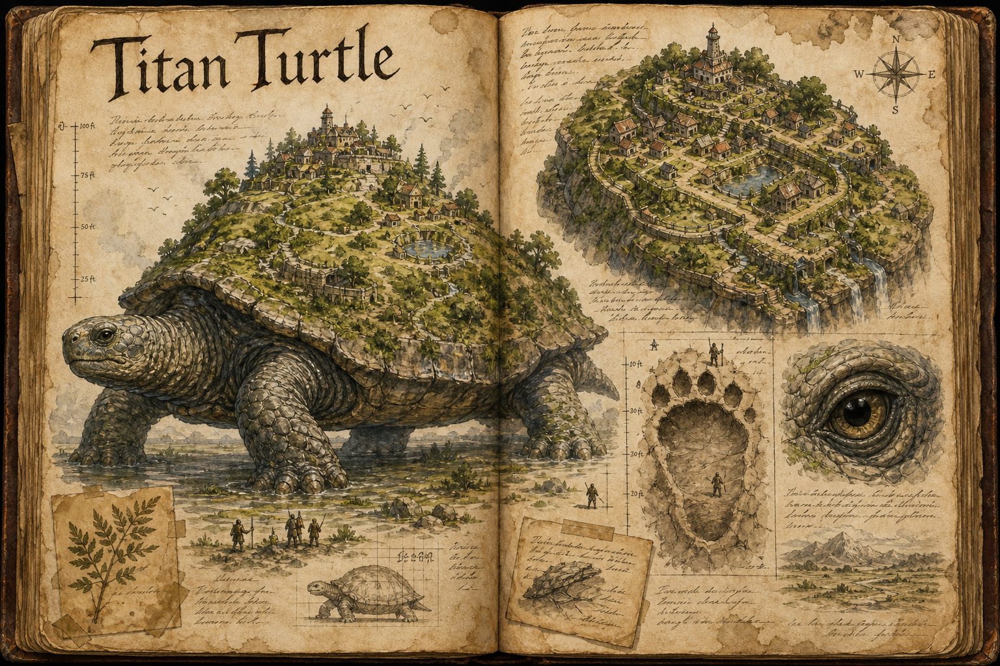

# Titan Turtle

The Titan Turtle is among the largest creatures that walk the world, a living landmark more than an enemy, and one of the elder beasts that [Setting and Lore](../Setting-and-lore.md) treats as a piece of the world's own myth still drawing breath. It is almost completely immune to harm, indifferent to nearly everything smaller than itself, and old beyond the span of any realm. To meet one is less an encounter than a feature of the landscape that happens to be moving.

## Appearance and Visual Design

A titan turtle reads first as terrain and only second as a creature. From a distance its shell is a rounded hillline broken by grass, shrubs, exposed rock, standing water, and the dark shapes of trees that have taken root in soil trapped between the shell plates. The oldest specimens carry miniature landscapes on their backs: footpaths worn by settlers, retaining walls bolted into ancient scutes, pond basins filled by rain, and cliff-like shell edges where waterfalls spill after storms. Only when the whole hill shifts, exhales, or lifts a foot from the ground does the full scale become clear.

The living body beneath that landscape is massive, weathered, and patient. Its skin is grey-green and fissured like old river stone, with barnacles, moss, and mud collecting around the joints. The eyes are dark, wet, and startlingly calm, set in a head large enough to feel like a moving gatehouse when it turns. Age changes the visual identity more than colour does: younger turtles have cleaner shell geometry and visible patterning, while ancient ones lose their outline beneath earth, settlement debris, roots, and the scars of centuries of weather.

## Anatomy and Growth

A titan turtle is sheathed in a shell that turns aside almost any attack; its only vulnerable points are its eyes and the softer skin around its joints, and reaching either is a feat in itself on a creature this size. It keeps growing for its entire life, slowing as it ages but never stopping, so age can be read directly from height. A turtle of around fifty years stands some 30 metres tall at the crown of its shell, and one of a century reaches 50 metres. The oldest carry whole ecosystems on their backs, with soil, grass, and even small trees taking root across the shell, and their eggs are laid the size of boulders. Because they never stop growing and some live for centuries, the truly ancient specimens are among the few sights in the world that can make a frontier feel small.

## The Walking Land

For all their size the old ones are not as slow as they look; growth costs them speed, but even a fifty-year turtle can outpace a running human, and there is almost nothing in the world with the will or the mass to turn one aside. A titan turtle simply walks where it is going, and what lies in its path, forest or town, is trampled flat and left behind as a trail of splintered ground and footprints sunk deep into the earth. Redirecting one is correspondingly close to impossible; the methods in [Taming and Control](../Taming-and-control.md) strain against a creature that nothing frightens and little can reward, and even a parental bond raised from the egg buys influence rather than obedience. They favour flat country and can be found crossing plains, forests, and swamps, and some wade through the shallows of lakes and oceans, so the [Plains](../Biomes/Plains.md) in particular learn to live around their slow, unstoppable migrations.

## Settlements on the Shell

A turtle large enough to carry a wood on its back can carry a town, and both NPC and player settlements take root on the oldest specimens, trading the safety of solid ground for a home no raider expects and no map can pin down. Living on a titan turtle is its own bargain: the shell is mobile, defensible, and unique, but its owner answers to the creature's wandering and to the day, however far off, when it decides to enter deep water or lie down to rest. A settlement on a turtle's back is one of the frontier's strangest footholds, and one of its best stories.

## Story Hook

A thriving market town has stood on one ancient turtle's shell for three generations, its people long since used to waking to a different horizon each morning. Now the creature has turned, for the first time in living memory, toward the coast and the open sea, and the town must decide whether to evacuate the only home some of them have known, find a way to coax a course change from a beast that has never once been steered, or trust that it will turn back before the water rises past the lowest streets.

See also: [Creatures index](../Creatures.md), the [Plains](../Biomes/Plains.md), [Forest](../Biomes/Forest.md), and [Swamp](../Biomes/Swamp.md) it crosses, and [Taming and Control](../Taming-and-control.md).

## Concept Drawing

## Draft

<!-- Raw notes land here. Add new content in any form; an AI assistant reworks it into the body above as finished prose, then clears what it has integrated. -->
