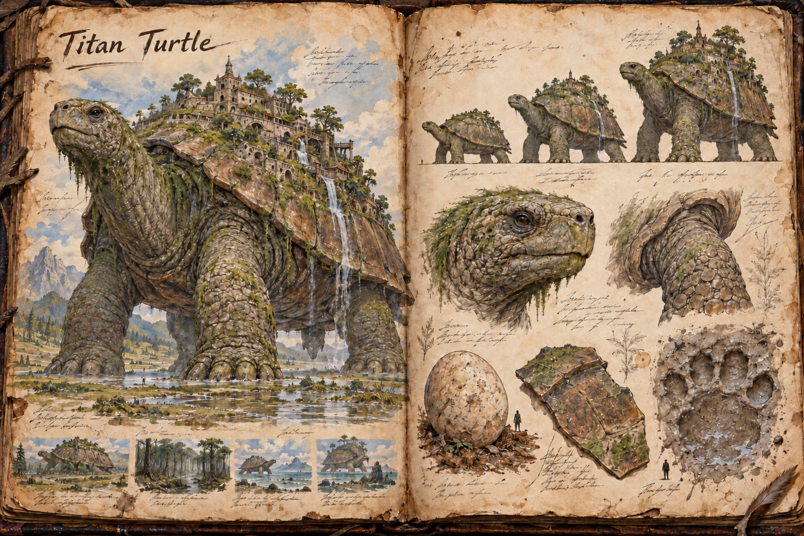

# Titan Turtle

The Titan Turtle is among the largest creatures that walk the world, a living landmark more than an enemy, and one of the elder beasts that [Setting and Lore](../Setting-and-lore.md) treats as a piece of the world's own myth still drawing breath. It is a land tortoise on a colossal scale: at fifty years it stands some 30 metres tall under a shell 55 metres long, at a century 50 metres tall under a shell 90 metres long, and the oldest living specimens reach about 70 metres. It is indifferent to nearly everything smaller than itself, and to meet one is less an encounter than a feature of the landscape that happens to be moving.

## Appearance and Visual Design

A titan turtle reads first as terrain and only second as a creature. From a distance its shell is a rounded hillline broken by grass, shrubs, exposed rock, standing water, and the dark shapes of trees that have taken root in soil trapped between the shell plates. The oldest specimens carry miniature landscapes on their backs: footpaths worn by settlers, retaining walls bolted into ancient scutes, pond basins filled by rain, and cliff-like shell edges where waterfalls spill after storms. Only when the whole hill shifts, exhales, or lifts a foot from the ground does the full scale become clear.

The body beneath is that of a tortoise rather than a sea turtle. Four thick, columnar legs carry the shell, each ending in a broad foot with heavy blunt toes, and a short tail hangs at the rear. The head is fixed and cannot withdraw into the shell; it is set on a thick neck and is large enough to feel like a moving gatehouse when it turns. The skin is grey-green and fissured like old river stone, with barnacles, moss, and mud collecting around the joints, and the shell is a darker, weathered brown-green that disappears under earth and vegetation as the animal ages. The eyes are dark, wet, and startlingly calm. Age changes the visual identity more than colour does: younger turtles show clean shell geometry and visible patterning, while ancient ones lose their outline beneath soil, settlement debris, roots, and the scars of centuries of weather.

## Anatomy and Growth

A titan turtle is sheathed in a shell that turns aside almost any attack; its only vulnerable points are its eyes and the softer skin around its joints, and reaching either is a feat in itself on a creature this size. It keeps growing for its entire life, slowing as it ages but never stopping, so age can be read directly from height. The oldest carry whole ecosystems on their backs, and their eggs are the size of boulders. Because they never stop growing and some live for centuries, the truly ancient specimens are among the few sights in the world that can make a frontier feel small.

## Movement and Migration

The steps of a titan turtle are slow and heavy, each foot lifted, swung forward, and set down with a tremor that carries through the ground, but each stride covers so much country that even a fifty-year turtle outpaces a running human. It moves steadily rather than in bursts, and there is almost nothing in the world with the will or the mass to turn one aside. What lies in its path, forest or town, is trampled flat and left behind as a trail of splintered ground and footprints sunk deep into the earth.

The turtles migrate by season between the [Plains](../Biomes/Plains.md), the [Forest](../Biomes/Forest.md), and the [Swamp](../Biomes/Swamp.md), favouring flat country. Before it rests, a turtle slows, stops, and lowers its head to the ground, which is the warning for anything living on its shell to prepare for the long stillness. Some turtles also wade into lakes and the sea off the [Coast](../Biomes/Coast.md), walking in over hours until the water reaches the shell's rim. A full dive into deep water is rare, and it is the great risk of a shell settlement, because everything built on the back goes under with it.

## Hunting and Taming

A titan turtle cannot be killed by one player or one party. It can be brought down only in a world-event hunt, in which many players and siege weapons spend a long fight working on those weak points. The hunt has a cost beyond the turtle itself: anyone living on its shell loses their home when it falls, so settlements on its back have every reason to defend it. A turtle that lives leaves rewards in its wake, shed shell scutes that can be gathered where it has passed, and rare eggs.

A titan turtle can be made to serve, but only by force. It follows the coercive route of [Taming and Control](../Taming-and-control.md) and the model in which a rider guides the creature's own will instead of puppeting it: players strap a saddle structure onto the shell and steer the turtle by hauling its head in the direction they want it to go with chains and reins, the way a rider controls an unwilling horse. The turtle resists, so the control has to be kept up, and when it fails the turtle goes its own way, which is dangerous for anything built on it.

## Settlements on the Shell

A turtle large enough to carry a wood on its back can carry a town, and both NPC and player settlements take root on the oldest specimens, trading the safety of solid ground for a home no raider expects and no map can pin down. The shell is mobile, defensible, and unique, but its owner answers to the creature's wandering and to the day, however far off, when it stops to rest or wades into deep water. A settlement on a turtle's back is one of the frontier's strangest footholds, and one of its best stories.

## Story Hook

A thriving market town has stood on one ancient turtle's shell for three generations, its people long since used to waking to a different horizon each morning. Now the creature has turned, for the first time in living memory, toward the coast and the open sea, and the town must decide whether to evacuate the only home some of them have known, try to haul the great head around with chains, or trust that it will turn back before the water rises past the lowest streets.

See also: [Creatures index](../Creatures.md), the [Plains](../Biomes/Plains.md), [Forest](../Biomes/Forest.md), and [Swamp](../Biomes/Swamp.md) it crosses, the [Coast](../Biomes/Coast.md) it sometimes wades into, and [Taming and Control](../Taming-and-control.md).

## Concept Drawing

## Draft

<!-- Raw notes land here. Add new content in any form; an AI assistant reworks it into the body above as finished prose, then clears what it has integrated. -->
