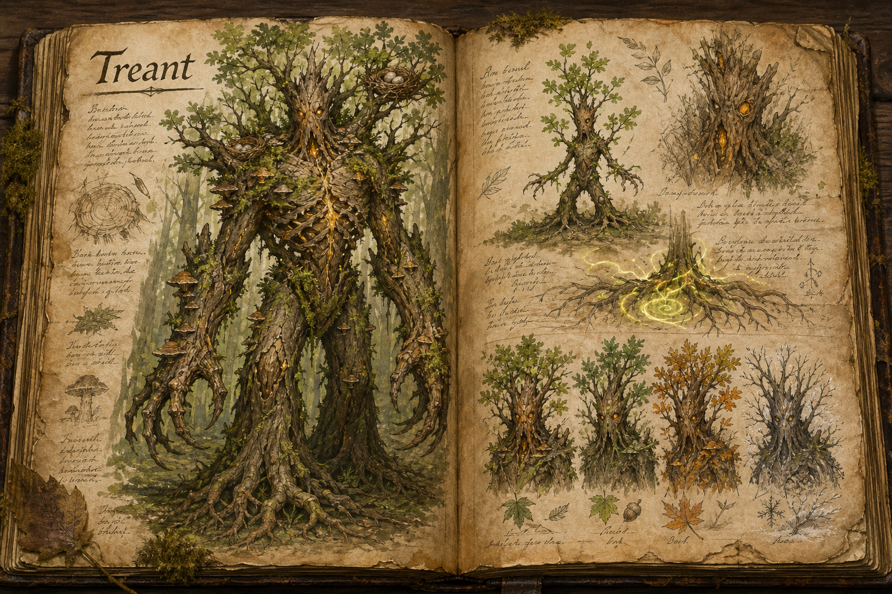

# Treant

Treants are living, humanoid tree creatures that embody the spirit of the forest, varying enormously in size and shape. The smallest stand barely a metre tall, while the largest reach an imposing eight metres. Their bark-covered bodies and natural camouflage let them blend into canopies and trunks until they are nearly indistinguishable from ordinary trees, so a grove a player has walked through a dozen times can turn out to have been watching them the whole time.

## Appearance and Visual Design

A treant's silhouette sits exactly on the edge between tree and person. Its torso is a split trunk twisted into a ribcage-like shape, its arms are heavy boughs that taper into branch-fingers, and its legs end in root masses that can sink into the soil when it stands still. Sapling treants look quick and wiry, with flexible green wood, leaf clusters like loose hair, and narrow faces hidden in knots. Elder treants are broader and stranger, carrying hollows, shelf fungus, hanging moss, bird nests, and whole crowns of canopy that make them read as part of the forest until they move.

Their faces are subtle, formed from cracks in bark, amber sap, and deep-set knots that glow faintly when the creature is alert. Seasonal variation gives them immediate local identity: spring treants carry pale buds and fresh shoots, summer ones are dense with leaves, autumn ones shed colour as they walk, and winter treants show bare black branches over bark like old ironwood. In combat, the visual language becomes more overtly magical, with roots surfacing around their feet, bark plates sliding over wounds, and green-gold mana moving under the grain like sap forced through living wood.

## Behaviour

Treants are typically neutral and peaceful, and they become aggressive only when provoked, either by a direct attack or by harm done to the trees and plants of their forest. They are fierce protectors of their environment, and once roused their retaliation is swift and relentless. This makes them less a monster to hunt than a consequence to avoid: a player who logs, burns, or clears carelessly in treant country is choosing a fight, while one who treads lightly can pass among them unharmed.

## Combat and Magic

When forced to fight, treants are remarkably versatile. They extend their wooden limbs to pierce enemies or sweep whole groups off their feet, and size determines role: the smaller ones are highly agile, using flexible branches to gain speed and swing between trees, while the largest act as living siege-engines, their thick bark giving immense durability and their strength letting them overpower foes in a prolonged battle. They are also wielders of earth magic, which they use to reshape and repair the forest, growing back felled plants, reinforcing their surroundings, and raising natural obstacles to hinder intruders. That command over growth is what makes a treant so dangerous on its own ground; the longer a fight runs in its forest, the more the terrain itself turns against the attacker.

## Habitat

Treants are found chiefly in the [Ancient Forest](../Biomes/Ancient-forest.md), the oldest and most magic-steeped of the woodlands, where the largest and most ancient specimens take root.

## Story Hook

Legend holds that a single sapling grew from a rune-seed planted by a long-dead druid. Over generations it learned to remember the names of those who tended it, and eventually became the first treant. Villagers still leave small tokens at the base of the oldest groves in hope of earning the forest's favour, and a player who does the same may find a guardian willing to let them pass where others are turned back.

See also: [Creatures index](../Creatures.md) and the [Ancient Forest](../Biomes/Ancient-forest.md).

## Concept Drawing

## Draft

<!-- Raw notes land here. Add new content in any form; an AI assistant reworks it into the body above as finished prose, then clears what it has integrated. -->
