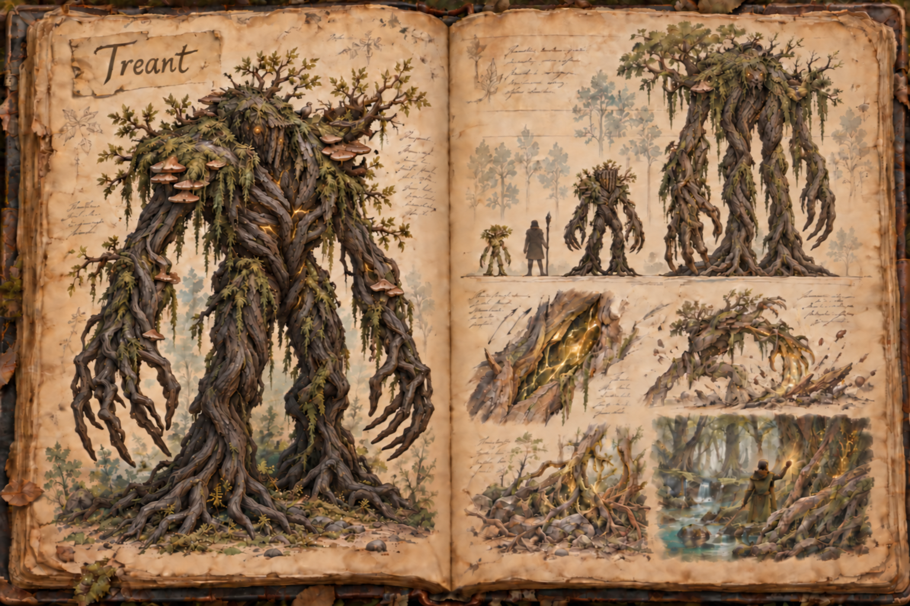

# Treant

Treants are living, humanoid tree creatures that embody the spirit of the [Ancient Forest](../Biomes/Ancient-forest.md), and they are the reason a player treats that forest as a place with an owner. They come in three tiers that differ in size, speed and role: the quick [Treant Sapling](Treant-sapling.md), the bough-armed [Treant Guardian](Treant-guardian.md) and the vast, slow [Treant Elder](Treant-elder.md). What they share is a temper. A treant is peaceful until the forest is harmed, and once it has been roused it does not stop until the offender has left. Their bark-covered bodies blend into trunks and canopy so well that a grove a player has walked through a dozen times can turn out to have been watching them the whole time.

## Living Wood and Earth Magic

A treant's silhouette sits on the edge between tree and person, and each tier file describes its own build. What every tier shares is the material: wood all the way through, with bark plates over the limbs and green-gold mana moving under the grain like sap, healing the way a tree does, by sliding bark over a wound and growing it shut.

The face is the subtlest part. It is never carved or painted but formed from cracks in the bark, amber sap and deep-set knots, and the knots glow faintly when the creature is alert. Every treant wears the season: spring ones carry pale buds and fresh shoots, summer ones are dense with leaves, autumn ones shed colour as they walk, and winter ones show bare black branches over bark like old ironwood.

Treants are wielders of earth magic, which they use to reshape and repair the forest. They grow felled plants back, reinforce the ground around a root-line and raise natural obstacles against intruders, and the longer a fight runs in their forest the more the terrain itself turns against the attacker. How much of that command a treant can bring to bear depends on its tier; the tier files describe each one.

## What Provokes Them

Treants do not hunt. They respond to harm done to the forest, and four acts count: felling trees, burning them, harvesting the rare reagents that grow among the roots, and attacking a treant itself. A player who logs, burns or clears carelessly in treant country is choosing a fight, while one who treads lightly and takes only what the forest offers freely can walk among them unharmed. The rare reagents tie this to the gathering loop described in the [Ancient Forest](../Biomes/Ancient-forest.md), where the best material grows exactly where the treants are thickest.

## The Warning Ladder

The response climbs in steps, and each step gives the player a chance to stop. It begins with the forest itself: timber creaks without wind, and branches close across the paths behind and ahead of the offender until the way out is narrower than the way in. If the offender carries on, Saplings appear in the branches and shadow them at a distance. If the offender still carries on, Guardians come down out of the trunks and attack. The last step is the Elder, which does not walk to the fight but turns the ground under it, raising roots and shifting thickets, and calls further Guardians to the place.

The ladder ends when the offender leaves the area or stops the act that started it. The treants do not pursue past the edge of their grove, and the forest reopens its paths behind a player who is walking away. [Elves](../Races/Elf.md) can shorten the climb. As the forest's stewards they are recognised by the treants, and an elf who steps between the offender and the wood and speaks for them brings the escalation to a halt, which is why a trespasser deep in the forest has reason to look for one.

Fire deserves its own warning. Bark burns, and flame drives a treant back further than any blade, but a fire in the forest is the most serious offence there is. It moves the offender several steps up the ladder at once, and the treants it draws in do not break off while the forest is still burning. Striking a treant is a shortcut of the same kind: a Sapling's cry calls the Guardians without waiting for the warnings in between.

## Habitat and Ecology

Treants are found chiefly in the [Ancient Forest](../Biomes/Ancient-forest.md), the oldest and most magic-steeped of the woodlands. The trees there climb hundreds of metres, and the larger tiers use that scale to hide: a Guardian or an Elder stands still among lower trees and thick bushes, roots sunk and face closed, and reads as one more trunk in a forest made of them. The Elves build their canopy settlements above the same ground, and the two peoples keep an old, unspoken bargain, in which the Elves tend the wood and the treants defend what the Elves tend. Treants yield heartwood, sap resin and bark plates, in proportions set by their tier.

## Story Hook

Legend holds that a single sapling grew from a rune-seed planted by a long-dead druid. Over generations it learned to remember the names of those who tended it, and it became the first treant. Villagers still leave small tokens at the base of the oldest groves in hope of earning the forest's favour, and a player who leaves the same token finds that the guardians of that grove let them pass where others are turned back.

See also: [Creatures index](../Creatures.md), the [Ancient Forest](../Biomes/Ancient-forest.md), the [Elves](../Races/Elf.md) who steward it, and the three tiers: [Treant Sapling](Treant-sapling.md), [Treant Guardian](Treant-guardian.md) and [Treant Elder](Treant-elder.md).

## Concept Drawing

## Draft

<!-- Raw notes land here. Add new content in any form; an AI assistant reworks it into the body above as finished prose, then clears what it has integrated. -->
