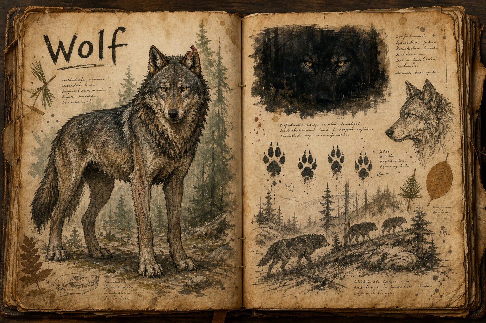

# Wolf

Wolves are one of the world's grounded, familiar early-game predators, the threat a player is most likely to meet on their first walk into the wild. They are deliberately recognisable, but they do not behave like the lone, suicidal wolves of most games. Here they are true pack hunters, and an encounter with them is a lesson in how the wilderness fights back as a group rather than as a single health bar.

## Appearance and Visual Design

A wolf looks natural enough to be trusted at a glance and dangerous enough that a player never mistakes it for background wildlife. Its frame is lean, long-legged, and built for endurance, with a heavy ruff around the neck, a narrow waist, and paws broad enough to leave readable tracks in mud, snow, and leaf litter. Forest packs wear muted coats of grey, brown, charcoal, and winter-white, broken by scars, torn ears, missing fur, and old bite marks that make each animal feel like a survivor of its own hierarchy.

The pack leader is identified by posture rather than by exaggerated decoration: it holds the highest ground, keeps its head lower when stalking, and fixes the player with a steadier gaze while the others move at the edges of vision. At night the eyes catch torchlight in brief yellow flashes, creating a visual rhythm of appearing and vanishing points around the player. Their animation sells coordination before aggression, with bodies crossing behind trunks, tails dropping before a charge, and shoulders rolling low when the pack begins to close the circle.

## Pack Tactics

Wolves hunt and fight as a unit, and that coordination is the whole point of the encounter. A pack will encircle, flank, and wear a target down, pressing from the sides while a player is fixed on the wolf in front of them, and they read advantage and disadvantage well enough to harry a weakened traveller and break off from a strong one. Fighting them rewards positioning over raw damage: putting your back to a tree or a rock face, dealing with the flankers before the leader, and refusing to be drawn out into open ground where the pack can work freely. A player who treats a wolf pack as several separate fights tends to lose; one who treats it as a single problem with several moving parts comes out ahead. They den in temperate woodland and range its edges, which makes the [Forest](../Biomes/Forest.md) the place most players first learn what a pack can do.

## Story Hook

On the edge of a northern encampment, an old hunter kept a carved wolf-bone talisman that the villagers believed kept the pack at bay. When he vanished, the talisman was found cracked beside a line of pawprints leading into the pines. Some say the pack took him; others that he ran with them and learned their ways. Either tale is told to children as both caution and legend, and a player who follows those prints far enough may find that one of them is closer to the truth than the village would like.

See also: [Creatures index](../Creatures.md) and the [Forest](../Biomes/Forest.md) it hunts in.

## Concept Drawing

## Draft

<!-- Raw notes land here. Add new content in any form; an AI assistant reworks it into the body above as finished prose, then clears what it has integrated. -->
