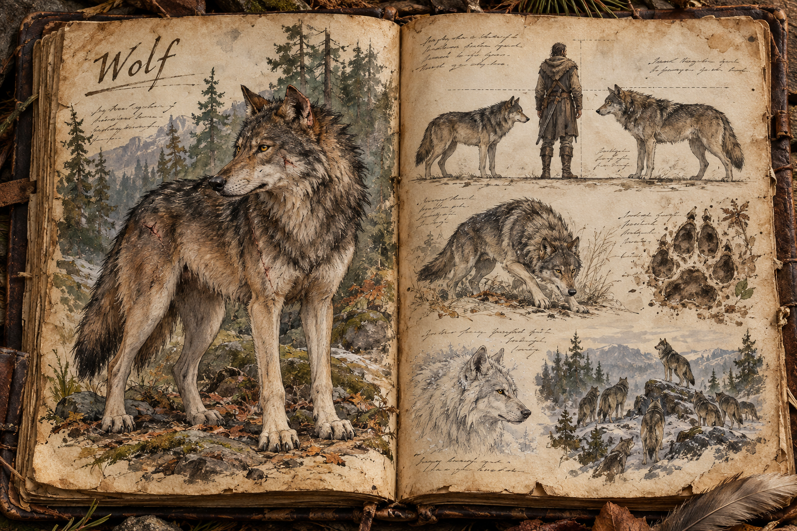
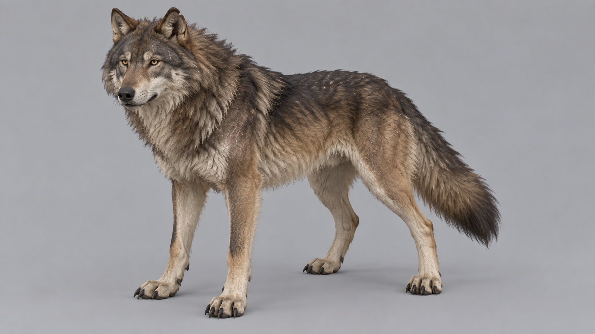

# Wolf

Wolves are the grounded, familiar early-game predator, the threat a player is most likely to meet on the first walk into the wild. They are deliberately recognisable, but they do not behave like the lone, suicidal wolves of most games. Here they are true pack hunters, packs of four to seven that work a target together, and an encounter with them is a lesson in how the wilderness fights back as a group rather than as a single health bar.

## Appearance and Visual Design

A wolf is a four-legged canine that stands 0,85 metres at the shoulder, runs about 1,60 metres from nose to rump with a further 0,50 metres of tail, and weighs between 45 and 60 kilograms. The pack leader is the largest animal in the pack, about 15 percent bigger than the rest. The frame is lean, long-legged and built for endurance: a deep chest, a narrow waist, a heavy ruff around the neck and shoulders, and broad paws that leave readable tracks in mud, snow and leaf litter.

Coats run grey, brown and charcoal, paler on the belly and the insides of the legs, with a darker saddle along the back. In winter every wolf grows a thick white-grey coat, so the same pack looks different from one season to the next (see [Weather, Time and Seasons](../Weather-time-and-seasons.md)). Scars, torn ears, patches of missing fur and old bite marks make each animal look like a survivor of its own hierarchy. At night the eyes catch torchlight in brief yellow flashes, a rhythm of points appearing and vanishing around the player.

## Movement and Posture

A wolf trots with its head level and its tail trailing, covering ground without effort, and breaks into a sprint that outruns a running player over short distances before it tires. The pack leader holds the highest ground, keeps its head lower when stalking and fixes the player with a steadier gaze, while the others move at the edges of vision, crossing behind trunks and rocks. The pack sells its coordination before its aggression: bodies passing behind cover, a slow closing of the circle, then the attack.

## Pack Tactics

Wolves circle and flank. They press from the sides while a player is fixed on the wolf in front, and they work toward an isolated target, the straggler of a group or the traveller who has stepped away from a fire. The killing move is a lunge that knocks the victim down, after which the rest of the pack closes in. Before a lunge the tail drops and the shoulders roll low, and that tell is the player's cue to turn and brace. A howl from any wolf calls nearby wolves into the fight, so a skirmish at the edge of a territory can grow into a full pack if it is not ended quickly.

Fighting them rewards positioning over raw damage. Putting your back to a tree or a rock face removes the flank, fire and torches make wolves hesitate and hold back from the light, and wounding the leader breaks the pack's nerve. They abandon a fight after losing about half their number, or when they face a group larger than their own, and they harry a weakened traveller as readily as they avoid a strong party. A player who treats a pack as several separate fights tends to lose; one who treats it as a single problem with several moving parts comes out ahead. They den in temperate woodland and range its edges, which makes the [Forest](../Biomes/Forest.md) the place most players first learn what a pack can do.

## Drops and Taming

A dead wolf yields hide, meat, bone and fangs, the staple materials of early clothing, food and crude weapons. Wolf pups found at a den can be raised through [Parental Bonding](../Taming-and-control.md), the strongest of the taming methods, which turns a dangerous hunter into a companion or a mount and gives the den a reason to be approached with something other than a spear.

## Story Hook

On the edge of a northern encampment, an old hunter kept a carved wolf-bone talisman that the villagers believed kept the pack at bay. When he vanished, the talisman was found cracked beside a line of pawprints leading into the pines. The prints end at a den, where the pack's pups lie in the roots beside the hunter's pack and a few scraps of his gear. A player who follows the trail has to decide what to do with a litter the pack will soon come back to: clear the den before the adults return, carry the pups away to raise them, or leave quietly and let the village keep its legend.

See also: [Creatures index](../Creatures.md) and the [Forest](../Biomes/Forest.md) it hunts in.

## Concept Drawing

## Draft

<!-- Raw notes land here. Add new content in any form; an AI assistant reworks it into the body above as finished prose, then clears what it has integrated. -->
