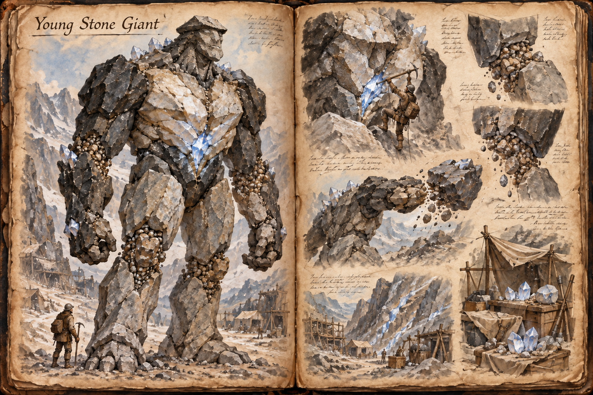

# Young Stone Giant

A mining crew that meets a giant by accident almost always meets a young one. The Young Stone Giant, the smallest form of the [Stone Giant](Stone-giant.md), is a humanoid of living rock between 5 and 15 metres tall and weighing tens of tonnes, and it is the one a party can realistically bring down. Young giants wander alone through the lower passes and the edges of the high country, and what they want, like every giant, is crystal.

## Appearance and Visual Design

A young giant is built like a person scaled up to the size of a house. It has two arms and two legs, a broad torso, and a blocky head with a ridged brow, and all of it is stone. The legs and lower body are coarse grey granite, the shoulders and arms a darker basalt, and the chest is banded with paler quartz. Mana crystals are small and few at this age, a line of blue-white points along the spine, clusters at the knuckles, and a bright seam over the chest where the heart sits, only a little above the middle of the body and within reach of a determined climber. The joints do not bend so much as grind from one locked angle to another, and gravel trails from the knees and elbows with each movement.

It walks with a heavy, upright stride. Each step covers several times what a person covers, but the cadence is slow, and a sprinting player can outrun one over open ground. Broken scree is better still, since the giant's weight turns every step there into a gamble. It does not climb well and it never runs.

## Encounter

A young giant roaming undisturbed keeps to its own business and ignores players. The conditions that turn it hostile are the ones in [Stone Giant](Stone-giant.md): crystals threatened, a climber on its body, or a hungry giant that meets a player with crystals in their pack. In a fight it leans on stomps and arm sweeps, which are quick enough to catch a careless player but slow enough to read, and on boulders torn from its own shoulders, which it throws at anyone who keeps to range. The shockwave comes late in a fight, when the giant is hurt.

A small, well-prepared party has real answers. The giant's heart is within reach, so the pickaxe route in the hub is open: platforms and grappling hooks get climbers to the chest while the rest of the party keeps the giant turned around, and a few good strikes at the heart finish it. The giant swats climbers and crushes platforms, but it cannot reach its own back quickly. Starving one takes little, since a young giant needs few crystals and the seams within its range are soon emptied. Siege weapons are overkill.

Feeding is cheap at this tier. A crew's regular share of crystal is enough to settle a young giant for days at a time, which makes it the giant a small mining camp can live alongside. The cost is that the camp has to keep paying, and a giant that matures on a camp's crystals grows into a much larger problem.

## Story Hook

A prospecting crew finds a rich seam on a pass and camps beside it, only to watch a young giant climb the slope toward them three mornings later, drawn by the crystals in their packs. They can lay out a share of ore and hope it turns away, fight it from the rocks, or abandon the seam, and the crew that feeds it is paying in crystal for a neighbour that will keep growing.

See also: [Creatures index](../Creatures.md), the [Stone Giant](Stone-giant.md) hub, the [Adult Stone Giant](Adult-stone-giant.md) it becomes, the [Elder Stone Giant](Elder-stone-giant.md), the [Building System](../Building-system.md) for climbing platforms, and the [Mountain Range](../Biomes/Mountain-range.md).

## Concept Drawing

## Draft

<!-- Raw notes land here. Add new content in any form; an AI assistant reworks it into the body above as finished prose, then clears what it has integrated. -->
