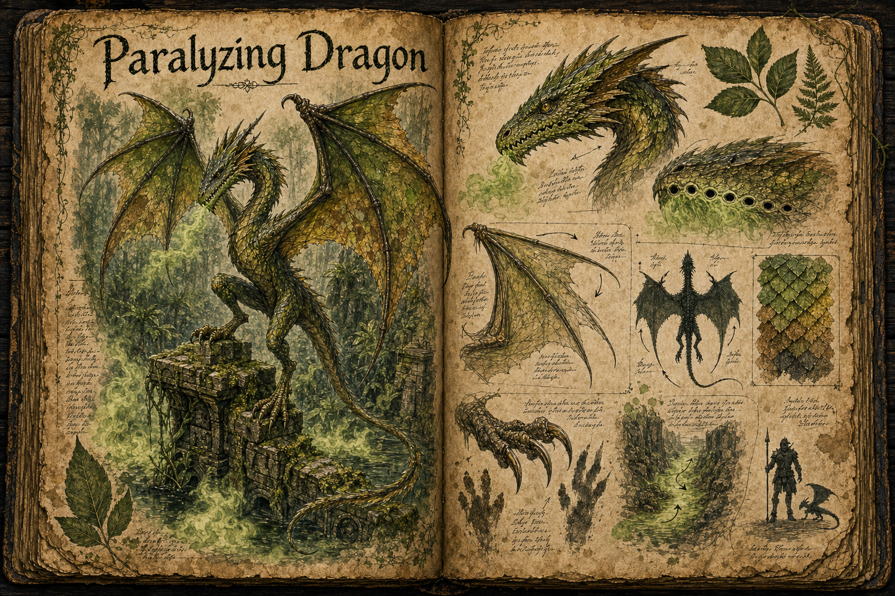

# Paralyzing Dragon

The Paralyzing Dragon is a small, green, wyvern-like jungle dragon built for speed, camouflage, and disabling ambushes rather than brute force. It stands only about as high as an average human, with two hind legs, two wing-forelimbs, a tapering tail, and a thin spear-like head that let it move through dense undergrowth without breaking the foliage around it. It has four limbs total and should never be depicted with separate front legs in addition to its wings. Where larger dragons dominate by fire and mass, this species survives by vanishing into the [Jungle](../Biomes/Jungle.md), striking first, and ending a hunt before its prey can properly fight back.

## Appearance and Visual Design

A Paralyzing Dragon should read as dangerous because it is hard to separate from the jungle itself. Its scales are layered in greens, yellow-browns, and damp black shadows, broken by leaf-shaped mottling that matches vines, moss, and filtered canopy light. When it crouches along a fallen trunk or coils beside a root wall, only the long line of the head and the glassy focus of the eyes give it away.

The body is slim by dragon standards, all whipcord muscle and folded tension. Its chest and shoulders are narrow, its hind legs are light and springy, and its wing bones serve as its forelimbs, folding down and back like wet leaves so the creature can slip between trunks and roots without snagging. The wings make short glides, sudden drops from low branches, and explosive balance corrections possible, but they do not turn the dragon into a high-soaring aerial predator. Its tail acts as a counterweight during sudden turns through trees and ruins. The head is long and thin, with slit-like nostrils and small vent openings along the jaw where paralytic gas leaks before a full breath. This gives observant players a readable warning: a faint greenish haze, a wet chemical hiss, or birds going silent before the dragon appears.

## Paralytic Breath

Instead of breathing fire, the Paralyzing Dragon exhales a low, clinging cloud of toxic gas. The breath does not need to kill directly; it steals movement, numbs muscles, and turns a capable player into easy prey if they stay inside the cloud too long. The gas works best in tight vegetation, temple corridors, hollow logs, and riverbank gullies where it lingers close to the ground rather than dispersing in open air.

This makes the creature a preparation and positioning encounter. Players who bring filters, antidotes, wind magic, elevation, or clear escape routes can fight it on fairer terms, while players who panic and back into foliage give the dragon exactly the short, confused pursuit it wants. A partial exposure should slow reactions and stamina recovery before full paralysis sets in, giving the victim a narrow window to crawl, call for help, or be dragged clear by an ally.

## Hunting Behaviour

The Paralyzing Dragon is extremely fast over short distances and rarely opens with a frontal charge. It shadows prey from the side, matching the rhythm of the jungle until the target passes through a choke point, then darts in to lay gas across the retreat path before striking from another angle. Once a victim is weakened, the dragon closes with claws and teeth, killing quickly and dragging the body into cover before scavengers or rival predators arrive.

In group encounters, its intelligence comes from movement rather than tactics that feel human. It separates the rear guard from the party, circles toward healers or ranged fighters, and retreats the moment open ground or sustained pressure turns against it. The ideal fight against one is tense and mobile: players listen for the hiss, watch the undergrowth, and decide whether to hold formation, climb above the gas, or push aggressively before the dragon can reset the ambush.

## Gameplay Role

The Paralyzing Dragon gives the jungle a predator that punishes careless speed without becoming another giant boss. It is deadly because it changes what the player can do, not because it simply has more health. Solo players can survive by reading signs and keeping terrain on their side, while groups gain chances for rescue play: pulling a paralyzed ally out of the cloud, covering a retreat, or flushing the dragon from concealment before it can make a second pass.

Its rewards should support jungle progression. Glands from the jaw can feed poison crafting, alchemy, or anti-paralysis remedies, while the camouflaged hide suits light armour, scouting gear, and stealth-focused equipment. Because the creature is small enough to appear more often than an apex dragon, it can become one of the jungle's signature dangers: not a world event, but the thing experienced travellers respect every time the canopy goes quiet.

## Story Hook

A gathering party returns from the jungle carrying one survivor who cannot move or speak, his armour filmed with green residue and claw marks cut only after he fell. The trail back to the attack site is strangely clean, except for birds watching from too high in the canopy and a patch of undergrowth where the air still tastes metallic. The players who follow it find a Paralyzing Dragon using an overgrown shrine as a hunting lane, gassing the entrances one by one and dragging victims into the roots below the altar.

See also: [Creatures index](../Creatures.md), the [Jungle](../Biomes/Jungle.md) it hunts, and [Crafting](../Crafting.md) for the poisons, remedies, and light gear its remains can support.

## Concept Drawing

## Draft

<!-- Raw notes land here. Add new content in any form; an AI assistant reworks it into the body above as finished prose, then clears what it has integrated. -->
